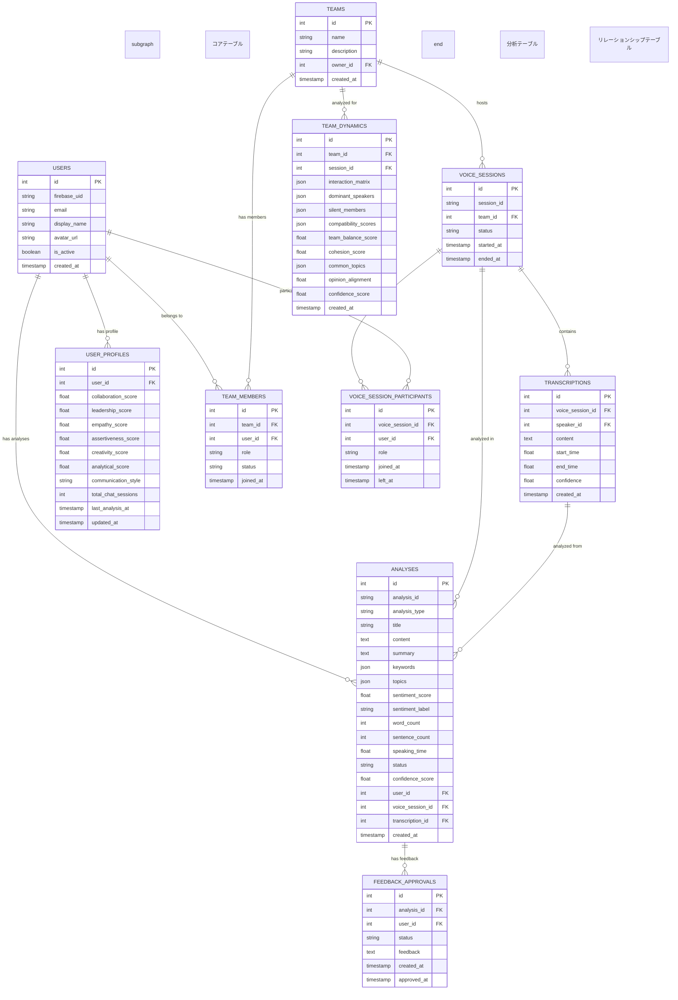

# BridgeLINE AI分析機能 アーキテクチャ図

## システム全体アーキテクチャ


## フロントエンド層 (Frontend Layer)


## バックエンド層 (Backend Layer)

```mermaid
graph TB
    subgraph "バックエンド層"
        subgraph "APIルーター層"
            A1[/analytics]
            A2[/analyses]
            TG[/topic-gen]
            TD[/team-dynamics]
        end
        
        subgraph "サービス層"
            AAS[AIAnalysisService]
            TGS[TopicGenerationService]
            TS[TranscriptionService]
            TDS[TeamDynamicsService]
            CAS[ComparisonAnalysisService]
            FAS[FeedbackApprovalService]
            PGS[PersonalGrowthService]
            RGS[ReportGenerationService]
        end
        
        subgraph "リポジトリ層"
            AR[AnalysisRepository]
            UR[UserRepository]
            TR[TranscriptionRepository]
            VSR[VoiceSessionRepository]
        end
        
        subgraph "統合層"
            OC[OpenAIClient]
            FC[FirebaseClient]
            SC[StripeClient]
            WM[WebSocketManager]
        end
    end
    
    A1 --> AAS
    A2 --> AAS
    TG --> TGS
    TD --> TDS
    
    AAS --> AR
    TGS --> AR
    TS --> TR
    TDS --> VSR
    
    AAS --> OC
    TGS --> OC
    TS --> OC
    FAS --> FC
    RGS --> SC
```

## データフロー (Data Flow)


## AI分析処理フロー (AI Analysis Processing Flow)


## データベース設計 (Database Design)



## セキュリティ・認証 (Security & Authentication)


## 外部サービス統合 (External Service Integration)


## パフォーマンス・スケーラビリティ (Performance & Scalability)


## 監視・ログ (Monitoring & Logging)


## 技術スタック (Technology Stack)

### フロントエンド
- **Framework**: Next.js 14 (React 18)
- **Language**: TypeScript
- **Styling**: Tailwind CSS + Radix UI
- **State Management**: React Hooks + Context API
- **Charts**: Recharts
- **Real-time**: WebSocket

### バックエンド
- **Framework**: FastAPI 0.110.1
- **Language**: Python 3.11+
- **Database**: PostgreSQL + SQLAlchemy (Async)
- **ORM**: SQLAlchemy 2.0
- **Authentication**: Firebase Auth + JWT
- **AI Integration**: OpenAI API (GPT-4, Whisper)
- **Real-time**: WebSocket + ASGI

### インフラストラクチャ
- **Container**: Docker + Docker Compose
- **Database**: PostgreSQL
- **Cache**: Redis (予定)
- **CDN**: CloudFront (予定)
- **Monitoring**: structlog + カスタムメトリクス

### 外部サービス
- **AI**: OpenAI GPT-4, Whisper
- **Auth**: Firebase Authentication
- **Payment**: Stripe
- **Storage**: Firebase Cloud Storage (予定)

## 主要機能一覧

### 1. 音声分析
- リアルタイム音声文字起こし
- 音声品質監視・最適化
- 話者識別・分離

### 2. AI分析
- 個性・性格特性分析
- コミュニケーションパターン分析
- 行動特性・スキル分析
- 感情分析・センチメント分析
- トピック分析・要約生成

### 3. チーム分析
- チームダイナミクス分析
- メンバー間相性分析
- チーム結束力・バランス評価
- 改善提案生成

### 4. プライバシー・セキュリティ
- データ暗号化
- 同意管理
- 可視性制御
- 承認ワークフロー
- 監査ログ

### 5. リアルタイム機能
- WebSocket通信
- リアルタイム分析更新
- 音声セッション管理
- 参加者管理

このアーキテクチャにより、BridgeLINEは高品質なAI分析機能を提供し、チームコミュニケーションの質向上と個人成長をサポートする包括的なプラットフォームを実現しています。
