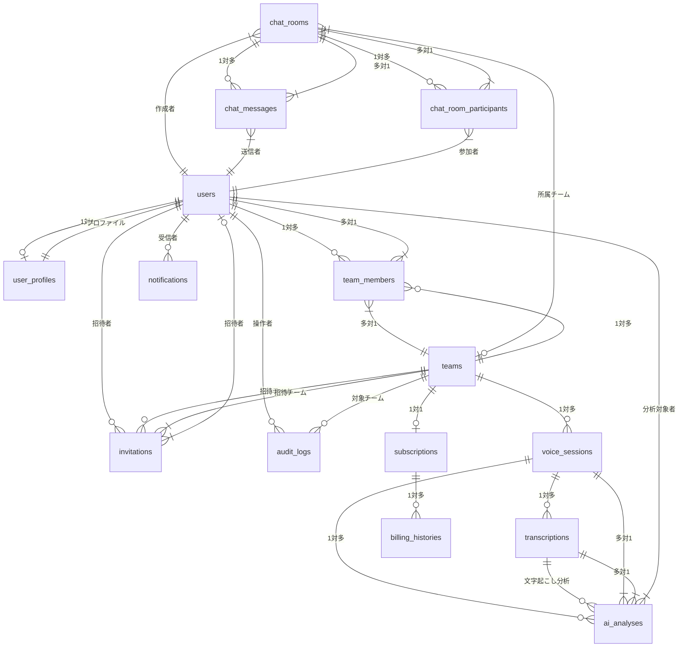

# Bridge LINE - データベース設計書

## **概要**

### システム概要

Bridge LINEは、BtoB向けチームコミュニケーションアプリケーションのデータベース設計です。音声チャット、AI分析、チーム管理、決済機能を統合したシステムを支えるPostgreSQLデータベース構成となっています。

### 技術仕様

- **データベース**: PostgreSQL 15
- **ORM**: SQLAlchemy 2.0.29
- **マイグレーション**: Alembic 1.13.1
- **文字セット**: UTF-8
- **タイムゾーン**: UTC
- **接続プール**: asyncpg 0.29.0
- **バックアップ**: 自動バックアップスクリプト対応

---

## 🗂️ **テーブル一覧 (15テーブル + 2ビュー)**

| No | テーブル名 | 用途 | 主な関連テーブル | 実装状況 |
| --- | --- | --- | --- | --- |
| 1 | `users` | ユーザー基本情報 | user_profiles, team_members | ✅ 実装済み |
| 2 | `user_profiles` | ユーザープロファイル・特性分析 | users | ✅ 実装済み |
| 3 | `teams` | チーム情報 | team_members, voice_sessions | ✅ 実装済み |
| 4 | `team_members` | チームメンバー関係 | users, teams | ✅ 実装済み |
| 5 | `voice_sessions` | 音声チャットセッション | transcriptions, ai_analyses | ✅ 実装済み |
| 6 | `transcriptions` | 音声文字起こし | voice_sessions, ai_analyses | ✅ 実装済み |
| 7 | `ai_analyses` | AI分析結果 | voice_sessions, transcriptions | ✅ 実装済み |
| 8 | `subscriptions` | サブスクリプション情報 | teams, billing_histories | 🔄 部分実装 |
| 9 | `billing_histories` | 決済履歴 | subscriptions | 🔄 部分実装 |
| 10 | `invitations` | チーム招待 | teams, users | ✅ 実装済み |
| 11 | `audit_logs` | 監査ログ | users, teams | ✅ 実装済み |
| 12 | `notifications` | 通知管理 | users | 🔄 部分実装 |
| 13 | `chat_rooms` | 雑談ルーム | chat_messages, chat_room_participants | ✅ 実装済み |
| 14 | `chat_messages` | チャットメッセージ | chat_rooms, users | ✅ 実装済み |
| 15 | `chat_room_participants` | ルーム参加者 | chat_rooms, users | ✅ 実装済み |

## **新機能・実装状況**

### **実装済み機能**
- ✅ **ユーザー認証・管理**: Firebase連携、ロール管理
- ✅ **チーム管理**: チーム作成・設定・メンバー管理
- ✅ **音声セッション**: WebSocket通信、セッション管理
- ✅ **チャットルーム**: テキストチャット、リアルタイム通信
- ✅ **参加者管理**: セッション参加者制御、権限管理
- ✅ **管理者機能**: 管理者ダッシュボード、ユーザー管理
- ✅ **監査ログ**: 操作履歴追跡、セキュリティ監査
- ✅ **AI分析システム**: 個性分析、コミュニケーション分析、行動特性分析
- ✅ **リアルタイム分析更新**: WebSocket経由での分析結果更新
- ✅ **データ可視化**: 分析結果のグラフ・チャート表示

### **部分実装・開発中**
- 🔄 **決済システム**: Stripe連携、サブスクリプション管理
- 🔄 **通知システム**: リアルタイム通知、メール通知
- 🔄 **音声品質向上**: AI音声処理、ノイズ除去

### **今後の拡張予定**
- 📋 **高度なAI分析**: チームダイナミクス分析、相性分析
- 📋 **プライバシー制御**: 暗号化データ保存、権限ベースアクセス制御
- 📋 **モバイル対応**: レスポンシブデザイン、PWA対応

---

## **(簡易)ER図**



## **主要テーブル詳細**

### **1. ユーザー管理テーブル**

#### **users**
```sql
CREATE TABLE users (
    id UUID PRIMARY KEY DEFAULT gen_random_uuid(),
    firebase_uid VARCHAR(128) UNIQUE NOT NULL,
    email VARCHAR(255) UNIQUE NOT NULL,
    display_name VARCHAR(100) NOT NULL,
    avatar_url TEXT,
    is_online BOOLEAN DEFAULT FALSE,
    last_seen_at TIMESTAMP WITH TIME ZONE,
    account_status VARCHAR(20) DEFAULT 'active',
    created_at TIMESTAMP WITH TIME ZONE DEFAULT NOW(),
    updated_at TIMESTAMP WITH TIME ZONE DEFAULT NOW()
);
```

#### **user_profiles**
```sql
CREATE TABLE user_profiles (
    id UUID PRIMARY KEY DEFAULT gen_random_uuid(),
    user_id UUID REFERENCES users(id) ON DELETE CASCADE,
    bio TEXT,
    department VARCHAR(100),
    position VARCHAR(100),
    interests JSONB,
    communication_style VARCHAR(50),
    collaboration_score DECIMAL(3,2),
    leadership_score DECIMAL(3,2),
    empathy_score DECIMAL(3,2),
    assertiveness_score DECIMAL(3,2),
    creativity_score DECIMAL(3,2),
    analytical_score DECIMAL(3,2),
    visibility_settings JSONB DEFAULT '{"profile": "public", "analytics": "private"}',
    total_chat_sessions INTEGER DEFAULT 0,
    total_speaking_time_seconds INTEGER DEFAULT 0,
    last_analysis_at TIMESTAMP WITH TIME ZONE,
    created_at TIMESTAMP WITH TIME ZONE DEFAULT NOW(),
    updated_at TIMESTAMP WITH TIME ZONE DEFAULT NOW()
);
```

### **2. チーム管理テーブル**

#### **teams**
```sql
CREATE TABLE teams (
    id UUID PRIMARY KEY DEFAULT gen_random_uuid(),
    name VARCHAR(100) NOT NULL,
    description TEXT,
    team_code VARCHAR(20) UNIQUE NOT NULL,
    created_by UUID REFERENCES users(id),
    max_members INTEGER DEFAULT 10,
    is_active BOOLEAN DEFAULT TRUE,
    settings JSONB DEFAULT '{}',
    created_at TIMESTAMP WITH TIME ZONE DEFAULT NOW(),
    updated_at TIMESTAMP WITH TIME ZONE DEFAULT NOW()
);
```

#### **team_members**
```sql
CREATE TABLE team_members (
    id UUID PRIMARY KEY DEFAULT gen_random_uuid(),
    team_id UUID REFERENCES teams(id) ON DELETE CASCADE,
    user_id UUID REFERENCES users(id) ON DELETE CASCADE,
    role VARCHAR(20) DEFAULT 'member' CHECK (role IN ('owner', 'admin', 'member')),
    status VARCHAR(20) DEFAULT 'active' CHECK (status IN ('active', 'inactive', 'invited')),
    joined_at TIMESTAMP WITH TIME ZONE DEFAULT NOW(),
    left_at TIMESTAMP WITH TIME ZONE,
    UNIQUE(team_id, user_id)
);
```

### **3. 音声チャット・分析テーブル**

#### **voice_sessions**
```sql
CREATE TABLE voice_sessions (
    id UUID PRIMARY KEY DEFAULT gen_random_uuid(),
    team_id UUID REFERENCES teams(id),
    title VARCHAR(200) NOT NULL,
    description TEXT,
    status VARCHAR(20) DEFAULT 'waiting' CHECK (status IN ('waiting', 'active', 'ended', 'cancelled')),
    max_participants INTEGER DEFAULT 10,
    started_by UUID REFERENCES users(id),
    started_at TIMESTAMP WITH TIME ZONE,
    ended_at TIMESTAMP WITH TIME ZONE,
    duration_seconds INTEGER,
    auto_transcription BOOLEAN DEFAULT TRUE,
    total_messages INTEGER DEFAULT 0,
    total_speaking_time_seconds INTEGER DEFAULT 0,
    created_at TIMESTAMP WITH TIME ZONE DEFAULT NOW(),
    updated_at TIMESTAMP WITH TIME ZONE DEFAULT NOW()
);
```

#### **transcriptions**
```sql
CREATE TABLE transcriptions (
    id UUID PRIMARY KEY DEFAULT gen_random_uuid(),
    voice_session_id UUID REFERENCES voice_sessions(id) ON DELETE CASCADE,
    speaker_id UUID REFERENCES users(id),
    text_content TEXT NOT NULL,
    confidence_score DECIMAL(3,2),
    audio_duration_seconds DECIMAL(5,2),
    session_timestamp_start INTEGER,
    session_timestamp_end INTEGER,
    transcription_method VARCHAR(50) DEFAULT 'openai_whisper',
    message_type VARCHAR(20) DEFAULT 'speech',
    detected_emotion VARCHAR(20),
    created_at TIMESTAMP WITH TIME ZONE DEFAULT NOW()
);
```

#### **ai_analyses**
```sql
CREATE TABLE ai_analyses (
    id UUID PRIMARY KEY DEFAULT gen_random_uuid(),
    voice_session_id UUID REFERENCES voice_sessions(id) ON DELETE CASCADE,
    transcription_id UUID REFERENCES transcriptions(id) ON DELETE CASCADE,
    user_id UUID REFERENCES users(id),
    analysis_type VARCHAR(50) NOT NULL,
    title VARCHAR(200),
    content TEXT,
    summary TEXT,
    keywords TEXT[],
    topics TEXT[],
    sentiment_score DECIMAL(3,2),
    sentiment_label VARCHAR(20),
    word_count INTEGER,
    sentence_count INTEGER,
    speaking_time INTEGER,
    status VARCHAR(20) DEFAULT 'completed',
    confidence_score DECIMAL(3,2),
    personality_traits JSONB,
    communication_patterns JSONB,
    behavior_scores JSONB,
    model_version VARCHAR(50),
    processing_time_ms INTEGER,
    created_at TIMESTAMP WITH TIME ZONE DEFAULT NOW(),
    updated_at TIMESTAMP WITH TIME ZONE DEFAULT NOW()
);
```

### **4. チャットルームテーブル**

#### **chat_rooms**
```sql
CREATE TABLE chat_rooms (
    id UUID PRIMARY KEY DEFAULT gen_random_uuid(),
    name VARCHAR(100) NOT NULL,
    description TEXT,
    created_by UUID REFERENCES users(id),
    team_id UUID REFERENCES teams(id),
    is_public BOOLEAN DEFAULT TRUE,
    max_participants INTEGER DEFAULT 50,
    created_at TIMESTAMP WITH TIME ZONE DEFAULT NOW(),
    updated_at TIMESTAMP WITH TIME ZONE DEFAULT NOW()
);
```

#### **chat_messages**
```sql
CREATE TABLE chat_messages (
    id UUID PRIMARY KEY DEFAULT gen_random_uuid(),
    chat_room_id UUID REFERENCES chat_rooms(id) ON DELETE CASCADE,
    sender_id UUID REFERENCES users(id),
    message_type VARCHAR(20) DEFAULT 'text',
    content TEXT NOT NULL,
    metadata JSONB DEFAULT '{}',
    created_at TIMESTAMP WITH TIME ZONE DEFAULT NOW()
);
```

#### **chat_room_participants**
```sql
CREATE TABLE chat_room_participants (
    id UUID PRIMARY KEY DEFAULT gen_random_uuid(),
    chat_room_id UUID REFERENCES chat_rooms(id) ON DELETE CASCADE,
    user_id UUID REFERENCES users(id) ON DELETE CASCADE,
    role VARCHAR(20) DEFAULT 'participant',
    joined_at TIMESTAMP WITH TIME ZONE DEFAULT NOW(),
    left_at TIMESTAMP WITH TIME ZONE,
    UNIQUE(chat_room_id, user_id)
);
```

### **5. 決済・サブスクリプションテーブル**

#### **subscriptions**
```sql
CREATE TABLE subscriptions (
    id UUID PRIMARY KEY DEFAULT gen_random_uuid(),
    team_id UUID REFERENCES teams(id) ON DELETE CASCADE,
    plan_name VARCHAR(50) NOT NULL,
    stripe_customer_id VARCHAR(100),
    stripe_subscription_id VARCHAR(100),
    status VARCHAR(20) DEFAULT 'active',
    billing_cycle VARCHAR(20) DEFAULT 'monthly',
    current_period_start TIMESTAMP WITH TIME ZONE,
    current_period_end TIMESTAMP WITH TIME ZONE,
    cancel_at_period_end BOOLEAN DEFAULT FALSE,
    created_at TIMESTAMP WITH TIME ZONE DEFAULT NOW(),
    updated_at TIMESTAMP WITH TIME ZONE DEFAULT NOW()
);
```

#### **billing_histories**
```sql
CREATE TABLE billing_histories (
    id UUID PRIMARY KEY DEFAULT gen_random_uuid(),
    subscription_id UUID REFERENCES subscriptions(id) ON DELETE CASCADE,
    stripe_payment_intent_id VARCHAR(100),
    amount DECIMAL(10,2) NOT NULL,
    currency VARCHAR(3) DEFAULT 'JPY',
    status VARCHAR(20),
    transaction_type VARCHAR(50),
    description TEXT,
    processed_at TIMESTAMP WITH TIME ZONE,
    created_at TIMESTAMP WITH TIME ZONE DEFAULT NOW()
);
```

### **6. 管理・監査テーブル**

#### **invitations**
```sql
CREATE TABLE invitations (
    id UUID PRIMARY KEY DEFAULT gen_random_uuid(),
    team_id UUID REFERENCES teams(id) ON DELETE CASCADE,
    email VARCHAR(255) NOT NULL,
    invited_by UUID REFERENCES users(id),
    role VARCHAR(20) DEFAULT 'member',
    status VARCHAR(20) DEFAULT 'pending',
    expires_at TIMESTAMP WITH TIME ZONE,
    created_at TIMESTAMP WITH TIME ZONE DEFAULT NOW(),
    updated_at TIMESTAMP WITH TIME ZONE DEFAULT NOW()
);
```

#### **audit_logs**
```sql
CREATE TABLE audit_logs (
    id UUID PRIMARY KEY DEFAULT gen_random_uuid(),
    user_id UUID REFERENCES users(id),
    team_id UUID REFERENCES teams(id),
    action VARCHAR(100) NOT NULL,
    resource_type VARCHAR(50),
    resource_id UUID,
    details JSONB,
    ip_address INET,
    user_agent TEXT,
    created_at TIMESTAMP WITH TIME ZONE DEFAULT NOW()
);
```

#### **notifications**
```sql
CREATE TABLE notifications (
    id UUID PRIMARY KEY DEFAULT gen_random_uuid(),
    user_id UUID REFERENCES users(id) ON DELETE CASCADE,
    title VARCHAR(200) NOT NULL,
    message TEXT NOT NULL,
    notification_type VARCHAR(50),
    is_read BOOLEAN DEFAULT FALSE,
    metadata JSONB DEFAULT '{}',
    created_at TIMESTAMP WITH TIME ZONE DEFAULT NOW(),
    read_at TIMESTAMP WITH TIME ZONE
);
```

## **インデックス・制約**

### **主要インデックス**
```sql
-- ユーザー関連
CREATE INDEX idx_users_firebase_uid ON users(firebase_uid);
CREATE INDEX idx_users_email ON users(email);
CREATE INDEX idx_users_online_status ON users(is_online, last_seen_at);

-- チーム関連
CREATE INDEX idx_team_members_team_user ON team_members(team_id, user_id);
CREATE INDEX idx_team_members_role ON team_members(role, status);

-- 音声セッション関連
CREATE INDEX idx_voice_sessions_team ON voice_sessions(team_id, status);
CREATE INDEX idx_voice_sessions_started_by ON voice_sessions(started_by);
CREATE INDEX idx_voice_sessions_created_at ON voice_sessions(created_at);

-- 分析関連
CREATE INDEX idx_ai_analyses_user ON ai_analyses(user_id, analysis_type);
CREATE INDEX idx_ai_analyses_session ON ai_analyses(voice_session_id);
CREATE INDEX idx_ai_analyses_created_at ON ai_analyses(created_at);

-- チャット関連
CREATE INDEX idx_chat_messages_room ON chat_messages(chat_room_id, created_at);
CREATE INDEX idx_chat_messages_sender ON chat_messages(sender_id);

-- 決済関連
CREATE INDEX idx_subscriptions_team ON subscriptions(team_id, status);
CREATE INDEX idx_billing_histories_subscription ON billing_histories(subscription_id);

-- 監査・通知関連
CREATE INDEX idx_audit_logs_user ON audit_logs(user_id, created_at);
CREATE INDEX idx_notifications_user ON notifications(user_id, is_read, created_at);
```

### **制約・バリデーション**
```sql
-- ユーザー状態の制約
ALTER TABLE users ADD CONSTRAINT chk_account_status 
    CHECK (account_status IN ('active', 'inactive', 'suspended'));

-- チームメンバーロールの制約
ALTER TABLE team_members ADD CONSTRAINT chk_team_member_role 
    CHECK (role IN ('owner', 'admin', 'member'));

-- 音声セッション状態の制約
ALTER TABLE voice_sessions ADD CONSTRAINT chk_session_status 
    CHECK (status IN ('waiting', 'active', 'ended', 'cancelled'));

-- 分析タイプの制約
ALTER TABLE ai_analyses ADD CONSTRAINT chk_analysis_type 
    CHECK (analysis_type IN ('personality', 'communication', 'behavior', 'sentiment', 'topic', 'summary'));

-- 感情スコアの範囲制約
ALTER TABLE ai_analyses ADD CONSTRAINT chk_sentiment_score 
    CHECK (sentiment_score >= -1 AND sentiment_score <= 1);

-- 信頼度スコアの範囲制約
ALTER TABLE ai_analyses ADD CONSTRAINT chk_confidence_score 
    CHECK (confidence_score >= 0 AND confidence_score <= 1);
```

## **データ整合性・プライバシー**

### **外部キー制約**
- 全ての関連テーブルに適切な外部キー制約を設定
- CASCADE削除によるデータ整合性の保証
- 参照整合性の自動チェック

### **プライバシー保護**
- ユーザープロファイルの可視性設定
- 分析結果の公開制御
- チーム内での情報共有制限

### **データ保持期間**
- 音声データ: 処理完了後24時間で自動削除
- 分析結果: 永続保存（ユーザー削除時は匿名化）
- 監査ログ: 1年間保持

## **パフォーマンス最適化**

### **クエリ最適化**
- 複合インデックスの活用
- 適切なJOIN戦略
- ページネーション対応

### **キャッシュ戦略**
- Redisによるセッション情報キャッシュ
- 分析結果の一時キャッシュ
- ユーザープロファイルのキャッシュ

### **バックアップ・復旧**
- 日次自動バックアップ
- ポイントインタイム復旧対応
- 災害復旧計画の策定

---

## **トリガー関数とプロシージャ**

### **1. user_profiles 自動更新トリガー**

```sql
-- AI分析結果からuser_profilesを更新する関数
CREATE OR REPLACE FUNCTION update_user_profile_from_analysis()
RETURNS TRIGGER AS $$
DECLARE
    session_participant_id UUID;
BEGIN
    -- 個人特性分析の場合のみ処理
    IF NEW.analysis_type = 'personality_analysis' AND NEW.behavioral_scores IS NOT NULL THEN

        -- voice_sessionの参加者を特定（簡略化：最初の参加者）
        -- 実際の実装では、transcriptionのspeaker_idベースで個別更新が必要
        SELECT tm.user_id INTO session_participant_id
        FROM voice_sessions vs
        JOIN team_members tm ON vs.team_id = tm.team_id
        WHERE vs.id = NEW.voice_session_id
        AND tm.status = 'active'
        LIMIT 1;

        IF session_participant_id IS NOT NULL THEN
            UPDATE user_profiles
            SET
                collaboration_score = COALESCE(
                    (NEW.behavioral_scores->>'collaboration')::decimal,
                    collaboration_score
                ),
                leadership_score = COALESCE(
                    (NEW.behavioral_scores->>'leadership')::decimal,
                    leadership_score
                ),
                empathy_score = COALESCE(
                    (NEW.behavioral_scores->>'empathy')::decimal,
                    empathy_score
                ),
                assertiveness_score = COALESCE(
                    (NEW.behavioral_scores->>'assertiveness')::decimal,
                    assertiveness_score
                ),
                creativity_score = COALESCE(
                    (NEW.behavioral_scores->>'creativity')::decimal,
                    creativity_score
                ),
                analytical_score = COALESCE(
                    (NEW.behavioral_scores->>'analytical')::decimal,
                    analytical_score
                ),
                communication_style = COALESCE(
                    NEW.communication_patterns->>'primary_style',
                    communication_style
                ),
                total_chat_sessions = total_chat_sessions + 1,
                last_analysis_at = NEW.created_at,
                updated_at = CURRENT_TIMESTAMP
            WHERE user_id = session_participant_id;
        END IF;
    END IF;

    RETURN NEW;
END;
$$ LANGUAGE plpgsql;

-- トリガー作成
CREATE TRIGGER trigger_update_user_profile_from_analysis
    AFTER INSERT ON ai_analyses
    FOR EACH ROW
    EXECUTE FUNCTION update_user_profile_from_analysis();

```

### **2. セッション統計更新トリガー**

```sql
-- voice_session終了時の統計更新
CREATE OR REPLACE FUNCTION update_session_statistics()
RETURNS TRIGGER AS $$
BEGIN
    -- セッションが完了状態に変更された場合
    IF OLD.status != 'completed' AND NEW.status = 'completed' THEN
        -- 参加者のuser_profilesを更新
        UPDATE user_profiles
        SET
            total_chat_sessions = total_chat_sessions + 1,
            total_speaking_time_seconds = total_speaking_time_seconds + COALESCE(
                (SELECT SUM(tr.end_time_seconds - tr.start_time_seconds)
                 FROM transcriptions tr
                 WHERE tr.voice_session_id = NEW.id
                 AND tr.speaker_id = user_profiles.user_id), 0
            ),
            updated_at = CURRENT_TIMESTAMP
        WHERE user_id IN (
            SELECT tm.user_id
            FROM team_members tm
            WHERE tm.team_id = NEW.team_id
            AND tm.status = 'active'
        );
    END IF;

    RETURN NEW;
END;
$$ LANGUAGE plpgsql;

-- トリガー作成
CREATE TRIGGER trigger_update_session_statistics
    AFTER UPDATE ON voice_sessions
    FOR EACH ROW
    EXECUTE FUNCTION update_session_statistics();

```

### **3. 期限切れ招待状のクリーンアップ**

```sql
-- 期限切れ招待状を自動的に無効化する関数
CREATE OR REPLACE FUNCTION cleanup_expired_invitations()
RETURNS void AS $$
BEGIN
    UPDATE invitations
    SET status = 'expired', updated_at = CURRENT_TIMESTAMP
    WHERE status = 'pending'
    AND expires_at < CURRENT_TIMESTAMP;
END;
$$ LANGUAGE plpgsql;

```

---

## **初期化スクリプト**

### **データベース初期化**

```sql
-- 拡張機能の有効化
CREATE EXTENSION IF NOT EXISTS "uuid-ossp";
CREATE EXTENSION IF NOT EXISTS "pg_trgm";

-- 既存ユーザーに対してuser_profilesレコードを作成
INSERT INTO user_profiles (user_id, visibility_settings)
SELECT id, '{"bio": true, "department": true, "position": true, "interests": true, "scores": false}'::jsonb
FROM users u
WHERE NOT EXISTS (
    SELECT 1 FROM user_profiles up WHERE up.user_id = u.id
);

-- サンプルデータの投入
-- 1. サンプルユーザー
INSERT INTO users (firebase_uid, email, display_name) VALUES
('firebase_uid_1', 'tanaka@example.com', '田中太郎'),
('firebase_uid_2', 'sato@example.com', '佐藤花子'),
('firebase_uid_3', 'suzuki@example.com', '鈴木次郎')
ON CONFLICT (email) DO NOTHING;

-- 2. ユーザープロファイル
INSERT INTO user_profiles (user_id, bio, department, position, interests, communication_style,
                          collaboration_score, leadership_score, empathy_score,
                          assertiveness_score, creativity_score, analytical_score,
                          visibility_settings) VALUES
((SELECT id FROM users WHERE email = 'tanaka@example.com'),
 'プロダクトマネージャーとして5年の経験があります。チームビルディングとユーザー体験の向上に情熱を注いでいます。',
 'プロダクト開発部', 'プロダクトマネージャー',
 '["UX/UI", "アジャイル開発", "データ分析", "チームマネジメント"]'::jsonb,
 'collaborative',
 8.5, 7.8, 8.2, 6.9, 7.5, 8.0,
 '{"bio": true, "department": true, "position": true, "interests": true, "scores": true}'::jsonb),

((SELECT id FROM users WHERE email = 'sato@example.com'),
 'フロントエンド開発が専門です。ユーザーフレンドリーなインターフェース作りを心がけています。',
 'エンジニアリング部', 'シニアフロントエンドエンジニア',
 '["React", "TypeScript", "デザインシステム", "アクセシビリティ"]'::jsonb,
 'analytical',
 7.2, 6.5, 7.8, 7.5, 8.8, 9.1,
 '{"bio": true, "department": true, "position": true, "interests": true, "scores": false}'::jsonb),

((SELECT id FROM users WHERE email = 'suzuki@example.com'),
 'バックエンド開発とインフラ構築を担当しています。スケーラブルなシステム設計が得意です。',
 'エンジニアリング部', 'バックエンドエンジニア',
 '["Python", "AWS", "データベース設計", "API開発"]'::jsonb,
 'assertive',
 6.8, 8.2, 6.5, 8.5, 7.0, 9.3,
 '{"bio": true, "department": true, "position": true, "interests": true, "scores": true}'::jsonb)
ON CONFLICT (user_id) DO NOTHING;

-- 3. サンプルチーム
INSERT INTO teams (name, description, owner_id) VALUES
('開発チーム', 'プロダクト開発を担当するメインチーム',
 (SELECT id FROM users WHERE email = 'tanaka@example.com')),
('デザインチーム', 'UI/UX設計を担当するチーム',
 (SELECT id FROM users WHERE email = 'sato@example.com'))
ON CONFLICT DO NOTHING;

```

---

## **パフォーマンス最適化**

### **重要なインデックス一覧**

```sql
-- 複合インデックス（クエリ最適化用）
CREATE INDEX idx_team_members_team_user_status ON team_members(team_id, user_id, status);
CREATE INDEX idx_voice_sessions_team_status_created ON voice_sessions(team_id, status, created_at);
CREATE INDEX idx_transcriptions_session_speaker_time ON transcriptions(voice_session_id, speaker_id, start_time_seconds);
CREATE INDEX idx_ai_analyses_session_type_created ON ai_analyses(voice_session_id, analysis_type, created_at);
CREATE INDEX idx_user_profiles_scores_composite ON user_profiles(collaboration_score, leadership_score, empathy_score) WHERE collaboration_score IS NOT NULL;

-- チャットルーム関連の複合インデックス
CREATE INDEX idx_chat_rooms_public_status_created ON chat_rooms(is_public, status, created_at);
CREATE INDEX idx_chat_messages_room_created_deleted ON chat_messages(chat_room_id, created_at, is_deleted);
CREATE INDEX idx_chat_room_participants_room_user_status ON chat_room_participants(chat_room_id, user_id, status);

-- JSONB検索用のGINインデックス
CREATE INDEX idx_user_profiles_interests_gin ON user_profiles USING gin(interests);
CREATE INDEX idx_user_profiles_visibility_gin ON user_profiles USING gin(visibility_settings);
CREATE INDEX idx_teams_settings_gin ON teams USING gin(settings);
CREATE INDEX idx_voice_sessions_settings_gin ON voice_sessions USING gin(settings);

```

### **定期メンテナンス**

```sql
-- 統計情報の更新（定期実行推奨）
ANALYZE users, user_profiles, teams, team_members, voice_sessions, transcriptions, ai_analyses;

-- 不要データのクリーンアップ（定期実行推奨）
DELETE FROM audit_logs WHERE created_at < CURRENT_DATE - INTERVAL '1 year';
DELETE FROM notifications WHERE is_read = true AND created_at < CURRENT_DATE - INTERVAL '30 days';
UPDATE invitations SET status = 'expired' WHERE status = 'pending' AND expires_at < CURRENT_TIMESTAMP;

-- チャットルーム関連のクリーンアップ
DELETE FROM chat_messages WHERE is_deleted = true AND updated_at < CURRENT_DATE - INTERVAL '90 days';
UPDATE chat_room_participants SET is_online = false WHERE last_active_at < CURRENT_TIMESTAMP - INTERVAL '5 minutes';

```

---

## **セキュリティ設定**

### **行レベルセキュリティ (RLS)**

```sql
-- ユーザーデータのアクセス制御
ALTER TABLE users ENABLE ROW LEVEL SECURITY;
ALTER TABLE user_profiles ENABLE ROW LEVEL SECURITY;
ALTER TABLE team_members ENABLE ROW LEVEL SECURITY;

-- ポリシー例：ユーザーは自分のプロファイルのみアクセス可能
CREATE POLICY user_profiles_policy ON user_profiles
    FOR ALL TO authenticated_users
    USING (user_id = current_user_id());

-- チームメンバーはチーム情報にアクセス可能
CREATE POLICY team_access_policy ON teams
    FOR SELECT TO authenticated_users
    USING (id IN (
        SELECT team_id FROM team_members
        WHERE user_id = current_user_id()
        AND status = 'active'
    ));

```

---

## **運用監視クエリ**

### **システム状況監視**

```sql
-- アクティブユーザー数
SELECT COUNT(*) as active_users
FROM users
WHERE is_active = true
AND last_active_at > CURRENT_DATE - INTERVAL '7 days';

-- チーム別セッション統計
SELECT
    t.name,
    COUNT(vs.id) as session_count,
    AVG(vs.duration_seconds) as avg_duration,
    COUNT(DISTINCT tm.user_id) as member_count
FROM teams t
LEFT JOIN voice_sessions vs ON t.id = vs.team_id
LEFT JOIN team_members tm ON t.id = tm.team_id AND tm.status = 'active'
WHERE t.is_active = true
GROUP BY t.id, t.name
ORDER BY session_count DESC;

-- AI分析処理状況
SELECT
    analysis_type,
    COUNT(*) as total_analyses,
    AVG(processing_time_ms) as avg_processing_time,
    AVG(confidence_score) as avg_confidence
FROM ai_analyses
WHERE created_at >= CURRENT_DATE - INTERVAL '30 days'
GROUP BY analysis_type
ORDER BY total_analyses DESC;

-- チャットルーム統計
SELECT
    COUNT(*) as total_rooms,
    COUNT(CASE WHEN is_public = true THEN 1 END) as public_rooms,
    COUNT(CASE WHEN status = 'active' THEN 1 END) as active_rooms,
    AVG(current_participants) as avg_participants,
    SUM(total_messages) as total_messages
FROM chat_rooms
WHERE created_at >= CURRENT_DATE - INTERVAL '30 days';

-- チャットメッセージ統計
SELECT
    message_type,
    COUNT(*) as total_messages,
    COUNT(CASE WHEN is_deleted = false THEN 1 END) as active_messages,
    AVG(LENGTH(content)) as avg_message_length
FROM chat_messages
WHERE created_at >= CURRENT_DATE - INTERVAL '7 days'
GROUP BY message_type
ORDER BY total_messages DESC;

```

---
