# Bridge LINE - データベース設計書

## 📊 **概要**

### システム概要

Bridge LINEは、BtoB向けチームコミュニケーションアプリケーションのデータベース設計です。音声チャット、AI分析、チーム管理、決済機能を統合したシステムを支えるPostgreSQLデータベース構成となっています。

### 技術仕様

- **データベース**: PostgreSQL 16.x
- **ORM**: SQLAlchemy 2.0.x
- **マイグレーション**: Alembic 1.13.x
- **文字セット**: UTF-8
- **タイムゾーン**: UTC

---

## 🗂️ **テーブル一覧 (15テーブル + 2ビュー)**

| No | テーブル名 | 用途 | 主な関連テーブル |
| --- | --- | --- | --- |
| 1 | `users` | ユーザー基本情報 | user_profiles, team_members |
| 2 | `user_profiles` | ユーザープロファイル・特性分析 | users |
| 3 | `teams` | チーム情報 | team_members, voice_sessions |
| 4 | `team_members` | チームメンバー関係 | users, teams |
| 5 | `voice_sessions` | 音声チャットセッション | transcriptions, ai_analyses |
| 6 | `transcriptions` | 音声文字起こし | voice_sessions, ai_analyses |
| 7 | `ai_analyses` | AI分析結果 | voice_sessions, transcriptions |
| 8 | `subscriptions` | サブスクリプション情報 | teams, billing_histories |
| 9 | `billing_histories` | 決済履歴 | subscriptions |
| 10 | `invitations` | チーム招待 | teams, users |
| 11 | `audit_logs` | 監査ログ | users, teams |
| 12 | `notifications` | 通知管理 | users |
| 13 | `chat_rooms` | 雑談ルーム | chat_messages, chat_room_participants |
| 14 | `chat_messages` | チャットメッセージ | chat_rooms, users |
| 15 | `chat_room_participants` | ルーム参加者 | chat_rooms, users |

---

## 🔗 **ER図**

```mermaid
erDiagram
    users ||--o| user_profiles : "1対1"
    users ||--o{ team_members : "1対多"
    users ||--o{ invitations : "招待者"
    users ||--o{ audit_logs : "操作者"
    users ||--o{ notifications : "受信者"

    user_profiles ||--|| users : "プロファイル"

    teams ||--o{ team_members : "1対多"
    teams ||--o{ voice_sessions : "1対多"
    teams ||--o| subscriptions : "1対1"
    teams ||--o{ invitations : "招待チーム"
    teams ||--o{ audit_logs : "対象チーム"

    team_members }|--|| users : "多対1"
    team_members }|--|| teams : "多対1"

    voice_sessions ||--o{ transcriptions : "1対多"
    voice_sessions ||--o{ ai_analyses : "1対多"

    transcriptions ||--o{ ai_analyses : "文字起こし分析"

    subscriptions ||--o{ billing_histories : "1対多"

    invitations }|--|| teams : "招待チーム"
    invitations }|--o| users : "招待者"

    chat_rooms ||--o{ chat_messages : "1対多"
    chat_rooms ||--o{ chat_room_participants : "1対多"
    chat_rooms }|--|| users : "作成者"
    chat_rooms }|--o| teams : "所属チーム"

    chat_messages }|--|| chat_rooms : "多対1"
    chat_messages }|--|| users : "送信者"

    chat_room_participants }|--|| chat_rooms : "多対1"
    chat_room_participants }|--|| users : "多対1"

```



---

## 📋 **テーブル詳細定義**

### **1. users (ユーザー基本情報)**

```sql
CREATE TABLE users (
    id UUID PRIMARY KEY DEFAULT gen_random_uuid(),
    firebase_uid VARCHAR(128) NOT NULL UNIQUE,
    email VARCHAR(255) NOT NULL UNIQUE,
    display_name VARCHAR(100) NOT NULL,
    avatar_url TEXT,
    is_active BOOLEAN DEFAULT true,
    last_active_at TIMESTAMP WITH TIME ZONE,
    created_at TIMESTAMP WITH TIME ZONE DEFAULT CURRENT_TIMESTAMP,
    updated_at TIMESTAMP WITH TIME ZONE DEFAULT CURRENT_TIMESTAMP
);

-- インデックス
CREATE INDEX idx_users_firebase_uid ON users(firebase_uid);
CREATE INDEX idx_users_email ON users(email);
CREATE INDEX idx_users_active ON users(is_active);
CREATE INDEX idx_users_last_active ON users(last_active_at);

-- 更新時刻自動更新関数
CREATE OR REPLACE FUNCTION update_updated_at_column()
RETURNS TRIGGER AS $$
BEGIN
    NEW.updated_at = CURRENT_TIMESTAMP;
    RETURN NEW;
END;
$$ LANGUAGE plpgsql;

-- 更新時刻自動更新トリガー
CREATE TRIGGER update_users_updated_at
    BEFORE UPDATE ON users
    FOR EACH ROW
    EXECUTE FUNCTION update_updated_at_column();

```

**フィールド説明**

| フィールド名 | 型 | 説明 | 制約 |
| --- | --- | --- | --- |
| `id` | UUID | プライマリキー | NOT NULL, PK |
| `firebase_uid` | VARCHAR(128) | Firebase認証UID | NOT NULL, UNIQUE |
| `email` | VARCHAR(255) | メールアドレス | NOT NULL, UNIQUE |
| `display_name` | VARCHAR(100) | 表示名 | NOT NULL |
| `avatar_url` | TEXT | アバター画像URL | - |
| `is_active` | BOOLEAN | アクティブ状態 | DEFAULT true |
| `last_active_at` | TIMESTAMP | 最終アクティブ日時 | - |
| `created_at` | TIMESTAMP | 作成日時 | 自動設定 |
| `updated_at` | TIMESTAMP | 更新日時 | 自動更新 |

---

### **2. user_profiles (ユーザープロファイル・特性分析)**

```sql
CREATE TABLE user_profiles (
    id UUID PRIMARY KEY DEFAULT gen_random_uuid(),
    user_id UUID NOT NULL REFERENCES users(id) ON DELETE CASCADE,
    bio TEXT,
    department VARCHAR(100),
    position VARCHAR(100),
    interests JSONB DEFAULT '[]'::jsonb,
    communication_style VARCHAR(50),
    collaboration_score DECIMAL(3,2) DEFAULT NULL
        CHECK (collaboration_score IS NULL OR (collaboration_score >= 0 AND collaboration_score <= 10)),
    leadership_score DECIMAL(3,2) DEFAULT NULL
        CHECK (leadership_score IS NULL OR (leadership_score >= 0 AND leadership_score <= 10)),
    empathy_score DECIMAL(3,2) DEFAULT NULL
        CHECK (empathy_score IS NULL OR (empathy_score >= 0 AND empathy_score <= 10)),
    assertiveness_score DECIMAL(3,2) DEFAULT NULL
        CHECK (assertiveness_score IS NULL OR (assertiveness_score >= 0 AND assertiveness_score <= 10)),
    creativity_score DECIMAL(3,2) DEFAULT NULL
        CHECK (creativity_score IS NULL OR (creativity_score >= 0 AND creativity_score <= 10)),
    analytical_score DECIMAL(3,2) DEFAULT NULL
        CHECK (analytical_score IS NULL OR (analytical_score >= 0 AND analytical_score <= 10)),
    visibility_settings JSONB DEFAULT '{"bio": true, "department": true, "position": true, "interests": true, "scores": false}'::jsonb,
    total_chat_sessions INTEGER DEFAULT 0 CHECK (total_chat_sessions >= 0),
    total_speaking_time_seconds INTEGER DEFAULT 0 CHECK (total_speaking_time_seconds >= 0),
    last_analysis_at TIMESTAMP WITH TIME ZONE,
    created_at TIMESTAMP WITH TIME ZONE DEFAULT CURRENT_TIMESTAMP,
    updated_at TIMESTAMP WITH TIME ZONE DEFAULT CURRENT_TIMESTAMP,

    CONSTRAINT unique_user_profile UNIQUE (user_id)
);

-- インデックス
CREATE INDEX idx_user_profiles_user_id ON user_profiles(user_id);
CREATE INDEX idx_user_profiles_department ON user_profiles(department);
CREATE INDEX idx_user_profiles_position ON user_profiles(position);
CREATE INDEX idx_user_profiles_communication_style ON user_profiles(communication_style);
CREATE INDEX idx_user_profiles_last_analysis ON user_profiles(last_analysis_at);
CREATE INDEX idx_user_profiles_collaboration_score ON user_profiles(collaboration_score);
CREATE INDEX idx_user_profiles_leadership_score ON user_profiles(leadership_score);

-- 更新時刻自動更新トリガー
CREATE TRIGGER update_user_profiles_updated_at
    BEFORE UPDATE ON user_profiles
    FOR EACH ROW
    EXECUTE FUNCTION update_updated_at_column();

```

**フィールド説明**

| フィールド名 | 型 | 説明 | 制約 |
| --- | --- | --- | --- |
| `id` | UUID | プライマリキー | NOT NULL, PK |
| `user_id` | UUID | ユーザーID (外部キー) | NOT NULL, FK, UNIQUE |
| `bio` | TEXT | 自己紹介文 | - |
| `department` | VARCHAR(100) | 所属部署 | - |
| `position` | VARCHAR(100) | 役職・ポジション | - |
| `interests` | JSONB | 興味・関心領域 | 配列形式、例: `["UX/UI", "データ分析"]` |
| `communication_style` | VARCHAR(50) | コミュニケーションスタイル | collaborative, analytical, assertive等 |
| `collaboration_score` | DECIMAL(3,2) | 協調性スコア | 0-10の範囲 |
| `leadership_score` | DECIMAL(3,2) | リーダーシップスコア | 0-10の範囲 |
| `empathy_score` | DECIMAL(3,2) | 共感性スコア | 0-10の範囲 |
| `assertiveness_score` | DECIMAL(3,2) | 主張性スコア | 0-10の範囲 |
| `creativity_score` | DECIMAL(3,2) | 創造性スコア | 0-10の範囲 |
| `analytical_score` | DECIMAL(3,2) | 分析力スコア | 0-10の範囲 |
| `visibility_settings` | JSONB | プロファイル公開設定 | 項目別表示制御 |
| `total_chat_sessions` | INTEGER | 総参加セッション数 | >= 0 |
| `total_speaking_time_seconds` | INTEGER | 総発話時間（秒） | >= 0 |
| `last_analysis_at` | TIMESTAMP | 最終AI分析日時 | - |
| `created_at` | TIMESTAMP | 作成日時 | 自動設定 |
| `updated_at` | TIMESTAMP | 更新日時 | 自動更新 |

---

### **3. teams (チーム情報)**

```sql
CREATE TABLE teams (
    id UUID PRIMARY KEY DEFAULT gen_random_uuid(),
    name VARCHAR(100) NOT NULL,
    description TEXT,
    owner_id UUID NOT NULL REFERENCES users(id) ON DELETE RESTRICT,
    settings JSONB DEFAULT '{}'::jsonb,
    max_members INTEGER DEFAULT 50 CHECK (max_members > 0),
    is_active BOOLEAN DEFAULT true,
    created_at TIMESTAMP WITH TIME ZONE DEFAULT CURRENT_TIMESTAMP,
    updated_at TIMESTAMP WITH TIME ZONE DEFAULT CURRENT_TIMESTAMP
);

-- インデックス
CREATE INDEX idx_teams_owner_id ON teams(owner_id);
CREATE INDEX idx_teams_name ON teams(name);
CREATE INDEX idx_teams_active ON teams(is_active);
CREATE INDEX idx_teams_created_at ON teams(created_at);

-- 更新時刻自動更新トリガー
CREATE TRIGGER update_teams_updated_at
    BEFORE UPDATE ON teams
    FOR EACH ROW
    EXECUTE FUNCTION update_updated_at_column();

```

**フィールド説明**

| フィールド名 | 型 | 説明 | 制約 |
| --- | --- | --- | --- |
| `id` | UUID | プライマリキー | NOT NULL, PK |
| `name` | VARCHAR(100) | チーム名 | NOT NULL |
| `description` | TEXT | チーム説明 | - |
| `owner_id` | UUID | チーム所有者ID | NOT NULL, FK |
| `settings` | JSONB | チーム設定 | 音声設定、通知設定等 |
| `max_members` | INTEGER | 最大メンバー数 | > 0, DEFAULT 50 |
| `is_active` | BOOLEAN | アクティブ状態 | DEFAULT true |
| `created_at` | TIMESTAMP | 作成日時 | 自動設定 |
| `updated_at` | TIMESTAMP | 更新日時 | 自動更新 |

---

### **4. team_members (チームメンバー関係)**

```sql
CREATE TABLE team_members (
    id UUID PRIMARY KEY DEFAULT gen_random_uuid(),
    team_id UUID NOT NULL REFERENCES teams(id) ON DELETE CASCADE,
    user_id UUID NOT NULL REFERENCES users(id) ON DELETE CASCADE,
    role VARCHAR(20) NOT NULL DEFAULT 'member' CHECK (role IN ('owner', 'admin', 'member')),
    status VARCHAR(20) NOT NULL DEFAULT 'active' CHECK (status IN ('active', 'inactive', 'pending')),
    joined_at TIMESTAMP WITH TIME ZONE DEFAULT CURRENT_TIMESTAMP,
    created_at TIMESTAMP WITH TIME ZONE DEFAULT CURRENT_TIMESTAMP,

    CONSTRAINT unique_team_member UNIQUE (team_id, user_id)
);

-- インデックス
CREATE INDEX idx_team_members_team_id ON team_members(team_id);
CREATE INDEX idx_team_members_user_id ON team_members(user_id);
CREATE INDEX idx_team_members_role ON team_members(role);
CREATE INDEX idx_team_members_status ON team_members(status);
CREATE INDEX idx_team_members_joined_at ON team_members(joined_at);

```

**フィールド説明**

| フィールド名 | 型 | 説明 | 制約 |
| --- | --- | --- | --- |
| `id` | UUID | プライマリキー | NOT NULL, PK |
| `team_id` | UUID | チームID | NOT NULL, FK |
| `user_id` | UUID | ユーザーID | NOT NULL, FK |
| `role` | VARCHAR(20) | チーム内役割 | owner, admin, member |
| `status` | VARCHAR(20) | メンバー状態 | active, inactive, pending |
| `joined_at` | TIMESTAMP | 参加日時 | 自動設定 |
| `created_at` | TIMESTAMP | 作成日時 | 自動設定 |

---

### **5. voice_sessions (音声チャットセッション)**

```sql
CREATE TABLE voice_sessions (
    id SERIAL PRIMARY KEY,
    session_id VARCHAR(255) UNIQUE NOT NULL,
    title VARCHAR(255),
    description TEXT,
    audio_file_path VARCHAR(500),
    audio_duration FLOAT,
    audio_format VARCHAR(50),
    file_size INTEGER,
    status VARCHAR(50),
    is_public BOOLEAN,
    is_analyzed BOOLEAN,
    participant_count INTEGER,
    participants TEXT,
    analysis_summary TEXT,
    sentiment_score FLOAT,
    key_topics TEXT,
    user_id INTEGER NOT NULL REFERENCES users(id),
    team_id INTEGER,
    created_at TIMESTAMP WITH TIME ZONE DEFAULT now(),
    updated_at TIMESTAMP WITH TIME ZONE,
    started_at TIMESTAMP WITH TIME ZONE,
    ended_at TIMESTAMP WITH TIME ZONE
);

-- インデックス
CREATE INDEX idx_voice_sessions_team_id ON voice_sessions(team_id);
CREATE INDEX idx_voice_sessions_status ON voice_sessions(status);
CREATE INDEX idx_voice_sessions_started_at ON voice_sessions(started_at);
CREATE INDEX idx_voice_sessions_created_at ON voice_sessions(created_at);

-- 更新時刻自動更新トリガー
CREATE TRIGGER update_voice_sessions_updated_at
    BEFORE UPDATE ON voice_sessions
    FOR EACH ROW
    EXECUTE FUNCTION update_updated_at_column();

```

**フィールド説明**

| フィールド名 | 型 | 説明 | 制約 |
| --- | --- | --- | --- |
| `id` | UUID | プライマリキー | NOT NULL, PK |
| `team_id` | UUID | チームID | NOT NULL, FK |
| `title` | VARCHAR(200) | セッションタイトル | - |
| `description` | TEXT | セッション説明 | - |
| `status` | VARCHAR(20) | セッション状態 | waiting, active, completed, cancelled |
| `started_at` | TIMESTAMP | 開始日時 | - |
| `ended_at` | TIMESTAMP | 終了日時 | - |
| `duration_seconds` | INTEGER | 継続時間（秒） | >= 0 |
| `participant_count` | INTEGER | 参加者数 | >= 0 |
| `max_participants` | INTEGER | 最大参加者数 | > 0, DEFAULT 10 |
| `recording_url` | TEXT | 録音ファイルURL | - |
| `recording_size_bytes` | BIGINT | 録音ファイルサイズ | >= 0 |
| `settings` | JSONB | セッション設定 | 録音設定、品質設定等 |
| `created_at` | TIMESTAMP | 作成日時 | 自動設定 |
| `updated_at` | TIMESTAMP | 更新日時 | 自動更新 |

---

### **6. transcriptions (音声文字起こし)**

```sql
CREATE TABLE transcriptions (
    id UUID PRIMARY KEY DEFAULT gen_random_uuid(),
    voice_session_id UUID NOT NULL REFERENCES voice_sessions(id) ON DELETE CASCADE,
    speaker_id UUID REFERENCES users(id) ON DELETE SET NULL,
    text_content TEXT NOT NULL,
    start_time_seconds DECIMAL(10,3) NOT NULL CHECK (start_time_seconds >= 0),
    end_time_seconds DECIMAL(10,3) NOT NULL CHECK (end_time_seconds >= start_time_seconds),
    confidence_score DECIMAL(4,3) CHECK (confidence_score >= 0 AND confidence_score <= 1),
    language VARCHAR(10) DEFAULT 'ja',
    processed_at TIMESTAMP WITH TIME ZONE DEFAULT CURRENT_TIMESTAMP,
    created_at TIMESTAMP WITH TIME ZONE DEFAULT CURRENT_TIMESTAMP
);

-- インデックス
CREATE INDEX idx_transcriptions_voice_session_id ON transcriptions(voice_session_id);
CREATE INDEX idx_transcriptions_speaker_id ON transcriptions(speaker_id);
CREATE INDEX idx_transcriptions_start_time ON transcriptions(start_time_seconds);
CREATE INDEX idx_transcriptions_processed_at ON transcriptions(processed_at);
CREATE INDEX idx_transcriptions_text_content ON transcriptions USING gin(to_tsvector('japanese', text_content));

```

**フィールド説明**

| フィールド名 | 型 | 説明 | 制約 |
| --- | --- | --- | --- |
| `id` | UUID | プライマリキー | NOT NULL, PK |
| `voice_session_id` | UUID | 音声セッションID | NOT NULL, FK |
| `speaker_id` | UUID | 発話者ID | FK (NULL可) |
| `text_content` | TEXT | 文字起こしテキスト | NOT NULL |
| `start_time_seconds` | DECIMAL(10,3) | 開始時刻（秒） | >= 0 |
| `end_time_seconds` | DECIMAL(10,3) | 終了時刻（秒） | >= start_time_seconds |
| `confidence_score` | DECIMAL(4,3) | 信頼度スコア | 0-1の範囲 |
| `language` | VARCHAR(10) | 言語コード | DEFAULT 'ja' |
| `processed_at` | TIMESTAMP | 処理完了日時 | 自動設定 |
| `created_at` | TIMESTAMP | 作成日時 | 自動設定 |

---

### **7. ai_analyses (AI分析結果)**

```sql
CREATE TABLE ai_analyses (
    id UUID PRIMARY KEY DEFAULT gen_random_uuid(),
    voice_session_id UUID NOT NULL REFERENCES voice_sessions(id) ON DELETE CASCADE,
    transcription_id UUID REFERENCES transcriptions(id) ON DELETE SET NULL,
    analysis_type VARCHAR(50) NOT NULL CHECK (analysis_type IN
        ('communication_analysis', 'sentiment_analysis', 'personality_analysis', 'team_dynamics', 'summary')),
    result JSONB NOT NULL DEFAULT '{}'::jsonb,
    confidence_score DECIMAL(4,3) CHECK (confidence_score >= 0 AND confidence_score <= 1),
    model_version VARCHAR(50),
    processing_time_ms INTEGER CHECK (processing_time_ms >= 0),

    -- user_profiles連携用のカラム
    personality_insights JSONB DEFAULT '{}'::jsonb,
    communication_patterns JSONB DEFAULT '{}'::jsonb,
    behavioral_scores JSONB DEFAULT '{}'::jsonb,

    created_at TIMESTAMP WITH TIME ZONE DEFAULT CURRENT_TIMESTAMP
);

-- インデックス
CREATE INDEX idx_ai_analyses_voice_session_id ON ai_analyses(voice_session_id);
CREATE INDEX idx_ai_analyses_transcription_id ON ai_analyses(transcription_id);
CREATE INDEX idx_ai_analyses_analysis_type ON ai_analyses(analysis_type);
CREATE INDEX idx_ai_analyses_created_at ON ai_analyses(created_at);
CREATE INDEX idx_ai_analyses_result ON ai_analyses USING gin(result);
CREATE INDEX idx_ai_analyses_personality ON ai_analyses USING gin(personality_insights);
CREATE INDEX idx_ai_analyses_communication ON ai_analyses USING gin(communication_patterns);
CREATE INDEX idx_ai_analyses_behavioral ON ai_analyses USING gin(behavioral_scores);

```

**フィールド説明**

| フィールド名 | 型 | 説明 | 制約 |
| --- | --- | --- | --- |
| `id` | UUID | プライマリキー | NOT NULL, PK |
| `voice_session_id` | UUID | 音声セッションID | NOT NULL, FK |
| `transcription_id` | UUID | 文字起こしID | FK (NULL可) |
| `analysis_type` | VARCHAR(50) | 分析タイプ | 定義値のみ |
| `result` | JSONB | 分析結果 | NOT NULL |
| `confidence_score` | DECIMAL(4,3) | 信頼度スコア | 0-1の範囲 |
| `model_version` | VARCHAR(50) | 使用モデルバージョン | - |
| `processing_time_ms` | INTEGER | 処理時間（ミリ秒） | >= 0 |
| `personality_insights` | JSONB | 個性洞察結果 | user_profiles更新用 |
| `communication_patterns` | JSONB | コミュニケーションパターン | user_profiles更新用 |
| `behavioral_scores` | JSONB | 行動特性スコア | user_profiles更新用 |
| `created_at` | TIMESTAMP | 作成日時 | 自動設定 |

---

### **8. subscriptions (サブスクリプション情報)**

```sql
CREATE TABLE subscriptions (
    id UUID PRIMARY KEY DEFAULT gen_random_uuid(),
    team_id UUID NOT NULL REFERENCES teams(id) ON DELETE CASCADE,
    stripe_subscription_id VARCHAR(255) NOT NULL UNIQUE,
    stripe_customer_id VARCHAR(255) NOT NULL,
    plan_type VARCHAR(50) NOT NULL CHECK (plan_type IN ('basic', 'premium', 'enterprise')),
    status VARCHAR(20) NOT NULL CHECK (status IN ('active', 'past_due', 'canceled', 'unpaid')),
    current_period_start TIMESTAMP WITH TIME ZONE NOT NULL,
    current_period_end TIMESTAMP WITH TIME ZONE NOT NULL,
    monthly_price DECIMAL(10,2) NOT NULL CHECK (monthly_price >= 0),
    currency VARCHAR(3) DEFAULT 'JPY',
    trial_end TIMESTAMP WITH TIME ZONE,
    canceled_at TIMESTAMP WITH TIME ZONE,
    created_at TIMESTAMP WITH TIME ZONE DEFAULT CURRENT_TIMESTAMP,
    updated_at TIMESTAMP WITH TIME ZONE DEFAULT CURRENT_TIMESTAMP,

    CONSTRAINT unique_team_subscription UNIQUE (team_id)
);

-- インデックス
CREATE INDEX idx_subscriptions_team_id ON subscriptions(team_id);
CREATE INDEX idx_subscriptions_stripe_subscription_id ON subscriptions(stripe_subscription_id);
CREATE INDEX idx_subscriptions_stripe_customer_id ON subscriptions(stripe_customer_id);
CREATE INDEX idx_subscriptions_status ON subscriptions(status);
CREATE INDEX idx_subscriptions_current_period_end ON subscriptions(current_period_end);

-- 更新時刻自動更新トリガー
CREATE TRIGGER update_subscriptions_updated_at
    BEFORE UPDATE ON subscriptions
    FOR EACH ROW
    EXECUTE FUNCTION update_updated_at_column();

```

**フィールド説明**

| フィールド名 | 型 | 説明 | 制約 |
| --- | --- | --- | --- |
| `id` | UUID | プライマリキー | NOT NULL, PK |
| `team_id` | UUID | チームID | NOT NULL, FK, UNIQUE |
| `stripe_subscription_id` | VARCHAR(255) | Stripe サブスクリプションID | NOT NULL, UNIQUE |
| `stripe_customer_id` | VARCHAR(255) | Stripe 顧客ID | NOT NULL |
| `plan_type` | VARCHAR(50) | プランタイプ | basic, premium, enterprise |
| `status` | VARCHAR(20) | サブスクリプション状態 | active, past_due, canceled, unpaid |
| `current_period_start` | TIMESTAMP | 現在の請求期間開始日 | NOT NULL |
| `current_period_end` | TIMESTAMP | 現在の請求期間終了日 | NOT NULL |
| `monthly_price` | DECIMAL(10,2) | 月額料金 | >= 0 |
| `currency` | VARCHAR(3) | 通貨コード | DEFAULT 'JPY' |
| `trial_end` | TIMESTAMP | トライアル終了日 | - |
| `canceled_at` | TIMESTAMP | キャンセル日時 | - |
| `created_at` | TIMESTAMP | 作成日時 | 自動設定 |
| `updated_at` | TIMESTAMP | 更新日時 | 自動更新 |

---

### **9. billing_histories (決済履歴)**

```sql
CREATE TABLE billing_histories (
    id UUID PRIMARY KEY DEFAULT gen_random_uuid(),
    subscription_id UUID NOT NULL REFERENCES subscriptions(id) ON DELETE CASCADE,
    stripe_invoice_id VARCHAR(255) NOT NULL UNIQUE,
    amount DECIMAL(10,2) NOT NULL CHECK (amount >= 0),
    currency VARCHAR(3) DEFAULT 'JPY',
    status VARCHAR(20) NOT NULL CHECK (status IN ('paid', 'open', 'void', 'uncollectible')),
    billing_reason VARCHAR(50),
    period_start TIMESTAMP WITH TIME ZONE NOT NULL,
    period_end TIMESTAMP WITH TIME ZONE NOT NULL,
    paid_at TIMESTAMP WITH TIME ZONE,
    invoice_pdf_url TEXT,
    created_at TIMESTAMP WITH TIME ZONE DEFAULT CURRENT_TIMESTAMP
);

-- インデックス
CREATE INDEX idx_billing_histories_subscription_id ON billing_histories(subscription_id);
CREATE INDEX idx_billing_histories_stripe_invoice_id ON billing_histories(stripe_invoice_id);
CREATE INDEX idx_billing_histories_status ON billing_histories(status);
CREATE INDEX idx_billing_histories_period_start ON billing_histories(period_start);
CREATE INDEX idx_billing_histories_paid_at ON billing_histories(paid_at);

```

**フィールド説明**

| フィールド名 | 型 | 説明 | 制約 |
| --- | --- | --- | --- |
| `id` | UUID | プライマリキー | NOT NULL, PK |
| `subscription_id` | UUID | サブスクリプションID | NOT NULL, FK |
| `stripe_invoice_id` | VARCHAR(255) | Stripe 請求書ID | NOT NULL, UNIQUE |
| `amount` | DECIMAL(10,2) | 請求金額 | >= 0 |
| `currency` | VARCHAR(3) | 通貨コード | DEFAULT 'JPY' |
| `status` | VARCHAR(20) | 請求書状態 | paid, open, void, uncollectible |
| `billing_reason` | VARCHAR(50) | 請求理由 | subscription_cycle, subscription_create等 |
| `period_start` | TIMESTAMP | 請求期間開始日 | NOT NULL |
| `period_end` | TIMESTAMP | 請求期間終了日 | NOT NULL |
| `paid_at` | TIMESTAMP | 支払い日時 | - |
| `invoice_pdf_url` | TEXT | 請求書PDF URL | - |
| `created_at` | TIMESTAMP | 作成日時 | 自動設定 |

---

### **10. invitations (チーム招待)**

```sql
CREATE TABLE invitations (
    id UUID PRIMARY KEY DEFAULT gen_random_uuid(),
    team_id UUID NOT NULL REFERENCES teams(id) ON DELETE CASCADE,
    inviter_id UUID NOT NULL REFERENCES users(id) ON DELETE CASCADE,
    email VARCHAR(255) NOT NULL,
    role VARCHAR(20) NOT NULL DEFAULT 'member' CHECK (role IN ('admin', 'member')),
    token VARCHAR(255) NOT NULL UNIQUE,
    status VARCHAR(20) NOT NULL DEFAULT 'pending'
        CHECK (status IN ('pending', 'accepted', 'declined', 'expired')),
    expires_at TIMESTAMP WITH TIME ZONE NOT NULL,
    accepted_at TIMESTAMP WITH TIME ZONE,
    created_at TIMESTAMP WITH TIME ZONE DEFAULT CURRENT_TIMESTAMP
);

-- インデックス
CREATE INDEX idx_invitations_team_id ON invitations(team_id);
CREATE INDEX idx_invitations_inviter_id ON invitations(inviter_id);
CREATE INDEX idx_invitations_email ON invitations(email);
CREATE INDEX idx_invitations_token ON invitations(token);
CREATE INDEX idx_invitations_status ON invitations(status);
CREATE INDEX idx_invitations_expires_at ON invitations(expires_at);

```

**フィールド説明**

| フィールド名 | 型 | 説明 | 制約 |
| --- | --- | --- | --- |
| `id` | UUID | プライマリキー | NOT NULL, PK |
| `team_id` | UUID | チームID | NOT NULL, FK |
| `inviter_id` | UUID | 招待者ID | NOT NULL, FK |
| `email` | VARCHAR(255) | 招待先メールアドレス | NOT NULL |
| `role` | VARCHAR(20) | 付与予定役割 | admin, member |
| `token` | VARCHAR(255) | 招待トークン | NOT NULL, UNIQUE |
| `status` | VARCHAR(20) | 招待状態 | pending, accepted, declined, expired |
| `expires_at` | TIMESTAMP | 有効期限 | NOT NULL |
| `accepted_at` | TIMESTAMP | 承諾日時 | - |
| `created_at` | TIMESTAMP | 作成日時 | 自動設定 |

---

### **11. audit_logs (監査ログ)**

```sql
CREATE TABLE audit_logs (
    id UUID PRIMARY KEY DEFAULT gen_random_uuid(),
    user_id UUID REFERENCES users(id) ON DELETE SET NULL,
    team_id UUID REFERENCES teams(id) ON DELETE SET NULL,
    action VARCHAR(100) NOT NULL,
    resource_type VARCHAR(50) NOT NULL,
    resource_id UUID,
    details JSONB DEFAULT '{}'::jsonb,
    ip_address INET,
    user_agent TEXT,
    created_at TIMESTAMP WITH TIME ZONE DEFAULT CURRENT_TIMESTAMP
);

-- インデックス
CREATE INDEX idx_audit_logs_user_id ON audit_logs(user_id);
CREATE INDEX idx_audit_logs_team_id ON audit_logs(team_id);
CREATE INDEX idx_audit_logs_action ON audit_logs(action);
CREATE INDEX idx_audit_logs_resource_type ON audit_logs(resource_type);
CREATE INDEX idx_audit_logs_resource_id ON audit_logs(resource_id);
CREATE INDEX idx_audit_logs_created_at ON audit_logs(created_at);

```

**フィールド説明**

| フィールド名 | 型 | 説明 | 制約 |
| --- | --- | --- | --- |
| `id` | UUID | プライマリキー | NOT NULL, PK |
| `user_id` | UUID | 操作ユーザーID | FK (NULL可) |
| `team_id` | UUID | 対象チームID | FK (NULL可) |
| `action` | VARCHAR(100) | 操作アクション | NOT NULL |
| `resource_type` | VARCHAR(50) | リソースタイプ | NOT NULL |
| `resource_id` | UUID | リソースID | - |
| `details` | JSONB | 操作詳細 | - |
| `ip_address` | INET | IPアドレス | - |
| `user_agent` | TEXT | ユーザーエージェント | - |
| `created_at` | TIMESTAMP | 作成日時 | 自動設定 |

---

### **12. notifications (通知管理)**

```sql
CREATE TABLE notifications (
    id UUID PRIMARY KEY DEFAULT gen_random_uuid(),
    user_id UUID NOT NULL REFERENCES users(id) ON DELETE CASCADE,
    type VARCHAR(50) NOT NULL,
    title VARCHAR(200) NOT NULL,
    message TEXT NOT NULL,
    data JSONB DEFAULT '{}'::jsonb,
    is_read BOOLEAN DEFAULT false,
    read_at TIMESTAMP WITH TIME ZONE,
    created_at TIMESTAMP WITH TIME ZONE DEFAULT CURRENT_TIMESTAMP
);

-- インデックス
CREATE INDEX idx_notifications_user_id ON notifications(user_id);
CREATE INDEX idx_notifications_type ON notifications(type);
CREATE INDEX idx_notifications_is_read ON notifications(is_read);
CREATE INDEX idx_notifications_created_at ON notifications(created_at);

```

**フィールド説明**

| フィールド名 | 型 | 説明 | 制約 |
| --- | --- | --- | --- |
| `id` | UUID | プライマリキー | NOT NULL, PK |
| `user_id` | UUID | 受信ユーザーID | NOT NULL, FK |
| `type` | VARCHAR(50) | 通知タイプ | NOT NULL |
| `title` | VARCHAR(200) | 通知タイトル | NOT NULL |
| `message` | TEXT | 通知メッセージ | NOT NULL |
| `data` | JSONB | 追加データ | - |
| `is_read` | BOOLEAN | 既読フラグ | DEFAULT false |
| `read_at` | TIMESTAMP | 既読日時 | - |
| `created_at` | TIMESTAMP | 作成日時 | 自動設定 |

---

### **13. chat_rooms (雑談ルーム)**

```sql
CREATE TABLE chat_rooms (
    id SERIAL PRIMARY KEY,
    room_id VARCHAR(255) UNIQUE NOT NULL,
    name VARCHAR(255) NOT NULL,
    description TEXT,
    is_public BOOLEAN DEFAULT false,
    max_participants INTEGER DEFAULT 50,
    current_participants INTEGER DEFAULT 0,
    status VARCHAR(50) DEFAULT 'active',
    room_type VARCHAR(50) DEFAULT 'general',
    participants TEXT,
    moderators TEXT,
    total_messages INTEGER DEFAULT 0,
    total_duration DOUBLE PRECISION DEFAULT 0,
    created_by INTEGER NOT NULL REFERENCES users(id),
    team_id INTEGER REFERENCES teams(id),
    is_active BOOLEAN DEFAULT true,
    created_at TIMESTAMP WITH TIME ZONE DEFAULT now(),
    updated_at TIMESTAMP WITH TIME ZONE
);

-- インデックス
CREATE INDEX idx_chat_rooms_id ON chat_rooms(id);
CREATE INDEX idx_chat_rooms_room_id ON chat_rooms(room_id);
CREATE INDEX idx_chat_rooms_created_by ON chat_rooms(created_by);
CREATE INDEX idx_chat_rooms_team_id ON chat_rooms(team_id);
CREATE INDEX idx_chat_rooms_status ON chat_rooms(status);
CREATE INDEX idx_chat_rooms_is_public ON chat_rooms(is_public);
CREATE INDEX idx_chat_rooms_created_at ON chat_rooms(created_at);

-- 更新時刻自動更新トリガー
CREATE TRIGGER update_chat_rooms_updated_at
    BEFORE UPDATE ON chat_rooms
    FOR EACH ROW
    EXECUTE FUNCTION update_updated_at_column();

```

**フィールド説明**

| フィールド名 | 型 | 説明 | 制約 |
| --- | --- | --- | --- |
| `id` | SERIAL | プライマリキー | NOT NULL, PK, AUTO_INCREMENT |
| `room_id` | VARCHAR(255) | ルーム識別子（UUID） | NOT NULL, UNIQUE |
| `name` | VARCHAR(255) | ルーム名 | NOT NULL |
| `description` | TEXT | ルーム説明 | - |
| `is_public` | BOOLEAN | 公開フラグ | DEFAULT false |
| `max_participants` | INTEGER | 最大参加者数 | DEFAULT 50 |
| `current_participants` | INTEGER | 現在の参加者数 | DEFAULT 0 |
| `status` | VARCHAR(50) | ルームステータス | DEFAULT 'active' |
| `room_type` | VARCHAR(50) | ルームタイプ | DEFAULT 'general' |
| `participants` | TEXT | 参加者情報（JSON） | - |
| `moderators` | TEXT | モデレーター情報（JSON） | - |
| `total_messages` | INTEGER | 総メッセージ数 | DEFAULT 0 |
| `total_duration` | DOUBLE PRECISION | 総通話時間 | DEFAULT 0 |
| `created_by` | INTEGER | 作成者ID | NOT NULL, FK |
| `team_id` | INTEGER | チームID | FK |
| `is_active` | BOOLEAN | アクティブフラグ | DEFAULT true |
| `created_at` | TIMESTAMP | 作成日時 | 自動設定 |
| `updated_at` | TIMESTAMP | 更新日時 | 自動更新 |

---

### **14. chat_messages (チャットメッセージ)**

```sql
CREATE TABLE chat_messages (
    id SERIAL PRIMARY KEY,
    message_id VARCHAR(255) UNIQUE NOT NULL,
    content TEXT NOT NULL,
    message_type VARCHAR(50) DEFAULT 'text',
    audio_file_path VARCHAR(500),
    audio_duration DOUBLE PRECISION,
    transcription TEXT,
    is_edited BOOLEAN DEFAULT false,
    is_deleted BOOLEAN DEFAULT false,
    chat_room_id INTEGER NOT NULL REFERENCES chat_rooms(id) ON DELETE CASCADE,
    sender_id INTEGER NOT NULL REFERENCES users(id),
    created_at TIMESTAMP WITH TIME ZONE DEFAULT now(),
    updated_at TIMESTAMP WITH TIME ZONE
);

-- インデックス
CREATE INDEX idx_chat_messages_id ON chat_messages(id);
CREATE INDEX idx_chat_messages_message_id ON chat_messages(message_id);
CREATE INDEX idx_chat_messages_chat_room_id ON chat_messages(chat_room_id);
CREATE INDEX idx_chat_messages_sender_id ON chat_messages(sender_id);
CREATE INDEX idx_chat_messages_message_type ON chat_messages(message_type);
CREATE INDEX idx_chat_messages_created_at ON chat_messages(created_at);
CREATE INDEX idx_chat_messages_is_deleted ON chat_messages(is_deleted);

-- 更新時刻自動更新トリガー
CREATE TRIGGER update_chat_messages_updated_at
    BEFORE UPDATE ON chat_messages
    FOR EACH ROW
    EXECUTE FUNCTION update_updated_at_column();

```

**フィールド説明**

| フィールド名 | 型 | 説明 | 制約 |
| --- | --- | --- | --- |
| `id` | SERIAL | プライマリキー | NOT NULL, PK, AUTO_INCREMENT |
| `message_id` | VARCHAR(255) | メッセージ識別子（UUID） | NOT NULL, UNIQUE |
| `content` | TEXT | メッセージ内容 | NOT NULL |
| `message_type` | VARCHAR(50) | メッセージタイプ | DEFAULT 'text' |
| `audio_file_path` | VARCHAR(500) | 音声ファイルパス | - |
| `audio_duration` | DOUBLE PRECISION | 音声時間 | - |
| `transcription` | TEXT | 文字起こし内容 | - |
| `is_edited` | BOOLEAN | 編集フラグ | DEFAULT false |
| `is_deleted` | BOOLEAN | 削除フラグ | DEFAULT false |
| `chat_room_id` | INTEGER | チャットルームID | NOT NULL, FK |
| `sender_id` | INTEGER | 送信者ID | NOT NULL, FK |
| `created_at` | TIMESTAMP | 作成日時 | 自動設定 |
| `updated_at` | TIMESTAMP | 更新日時 | 自動更新 |

---

### **15. chat_room_participants (ルーム参加者)**

```sql
CREATE TABLE chat_room_participants (
    id SERIAL PRIMARY KEY,
    chat_room_id INTEGER NOT NULL REFERENCES chat_rooms(id) ON DELETE CASCADE,
    user_id INTEGER NOT NULL REFERENCES users(id) ON DELETE CASCADE,
    role VARCHAR(50) DEFAULT 'member',
    status VARCHAR(50) DEFAULT 'active',
    is_online BOOLEAN DEFAULT false,
    joined_at TIMESTAMP WITH TIME ZONE DEFAULT now(),
    last_active_at TIMESTAMP WITH TIME ZONE,
    total_messages INTEGER DEFAULT 0
);

-- インデックス
CREATE INDEX idx_chat_room_participants_id ON chat_room_participants(id);
CREATE INDEX idx_chat_room_participants_chat_room_id ON chat_room_participants(chat_room_id);
CREATE INDEX idx_chat_room_participants_user_id ON chat_room_participants(user_id);
CREATE INDEX idx_chat_room_participants_role ON chat_room_participants(role);
CREATE INDEX idx_chat_room_participants_status ON chat_room_participants(status);
CREATE INDEX idx_chat_room_participants_is_online ON chat_room_participants(is_online);
CREATE INDEX idx_chat_room_participants_joined_at ON chat_room_participants(joined_at);

-- ユニーク制約（同じユーザーが同じルームに重複参加できない）
CREATE UNIQUE INDEX idx_chat_room_participants_unique ON chat_room_participants(chat_room_id, user_id);

```

**フィールド説明**

| フィールド名 | 型 | 説明 | 制約 |
| --- | --- | --- | --- |
| `id` | SERIAL | プライマリキー | NOT NULL, PK, AUTO_INCREMENT |
| `chat_room_id` | INTEGER | チャットルームID | NOT NULL, FK |
| `user_id` | INTEGER | ユーザーID | NOT NULL, FK |
| `role` | VARCHAR(50) | 参加者ロール | DEFAULT 'member' |
| `status` | VARCHAR(50) | 参加者ステータス | DEFAULT 'active' |
| `is_online` | BOOLEAN | オンライン状態 | DEFAULT false |
| `joined_at` | TIMESTAMP | 参加日時 | 自動設定 |
| `last_active_at` | TIMESTAMP | 最終アクティブ日時 | - |
| `total_messages` | INTEGER | 総メッセージ数 | DEFAULT 0 |

---

## 📊 **ビュー定義**

### **1. user_team_summary_view (ユーザー・チーム統合ビュー)**

```sql
CREATE VIEW user_team_summary_view AS
SELECT
    u.id,
    u.firebase_uid,
    u.email,
    u.display_name,
    u.avatar_url,
    up.bio,
    up.department,
    up.position,
    up.communication_style,
    up.collaboration_score,
    up.leadership_score,
    up.empathy_score,
    up.total_chat_sessions,
    up.total_speaking_time_seconds,
    COUNT(DISTINCT tm.team_id) as team_count,
    ARRAY_AGG(DISTINCT t.name ORDER BY t.name) FILTER (WHERE t.name IS NOT NULL) as team_names,
    ARRAY_AGG(DISTINCT tm.role ORDER BY tm.role) FILTER (WHERE tm.role IS NOT NULL) as team_roles,
    u.last_active_at,
    u.created_at
FROM users u
LEFT JOIN user_profiles up ON u.id = up.user_id
LEFT JOIN team_members tm ON u.id = tm.user_id AND tm.status = 'active'
LEFT JOIN teams t ON tm.team_id = t.id AND t.is_active = true
WHERE u.is_active = true
GROUP BY u.id, u.firebase_uid, u.email, u.display_name, u.avatar_url,
         up.bio, up.department, up.position, up.communication_style,
         up.collaboration_score, up.leadership_score, up.empathy_score,
         up.total_chat_sessions, up.total_speaking_time_seconds,
         u.last_active_at, u.created_at;

```

### **2. team_analytics_summary_view (チーム分析統合ビュー)**

```sql
CREATE VIEW team_analytics_summary_view AS
SELECT
    t.id as team_id,
    t.name as team_name,
    t.description as team_description,
    u_owner.display_name as owner_name,
    COUNT(DISTINCT tm.user_id) as member_count,
    COUNT(DISTINCT vs.id) as total_sessions,
    COALESCE(SUM(vs.duration_seconds), 0) as total_duration_seconds,
    COALESCE(ROUND(AVG(vs.duration_seconds)), 0) as avg_session_duration,
    COUNT(DISTINCT tr.id) as total_transcriptions,
    COUNT(DISTINCT ai.id) as total_analyses,

    -- プロファイル統計
    ROUND(AVG(up.collaboration_score), 2) as avg_collaboration_score,
    ROUND(AVG(up.leadership_score), 2) as avg_leadership_score,
    ROUND(AVG(up.empathy_score), 2) as avg_empathy_score,
    ROUND(AVG(up.assertiveness_score), 2) as avg_assertiveness_score,
    ROUND(AVG(up.creativity_score), 2) as avg_creativity_score,
    ROUND(AVG(up.analytical_score), 2) as avg_analytical_score,

    -- 部署・役職分布
    JSONB_AGG(DISTINCT up.department) FILTER (WHERE up.department IS NOT NULL) as departments,
    JSONB_AGG(DISTINCT up.position) FILTER (WHERE up.position IS NOT NULL) as positions,
    JSONB_AGG(DISTINCT up.communication_style) FILTER (WHERE up.communication_style IS NOT NULL) as communication_styles,

    -- 活動統計
    MAX(vs.created_at) as last_session_at,
    COUNT(DISTINCT CASE WHEN u.last_active_at >= CURRENT_DATE - INTERVAL '7 days' THEN u.id END) as active_members_week,
    COUNT(DISTINCT CASE WHEN u.last_active_at >= CURRENT_DATE - INTERVAL '30 days' THEN u.id END) as active_members_month,

    -- サブスクリプション情報
    s.plan_type,
    s.status as subscription_status,

    t.created_at as team_created_at
FROM teams t
LEFT JOIN users u_owner ON t.owner_id = u_owner.id
LEFT JOIN team_members tm ON t.id = tm.team_id AND tm.status = 'active'
LEFT JOIN users u ON tm.user_id = u.id AND u.is_active = true
LEFT JOIN user_profiles up ON u.id = up.user_id
LEFT JOIN voice_sessions vs ON t.id = vs.team_id
LEFT JOIN transcriptions tr ON vs.id = tr.voice_session_id
LEFT JOIN ai_analyses ai ON vs.id = ai.voice_session_id
LEFT JOIN subscriptions s ON t.id = s.team_id
WHERE t.is_active = true
GROUP BY t.id, t.name, t.description, u_owner.display_name, s.plan_type, s.status, t.created_at;

```

---

## 🔧 **トリガー関数とプロシージャ**

### **1. user_profiles 自動更新トリガー**

```sql
-- AI分析結果からuser_profilesを更新する関数
CREATE OR REPLACE FUNCTION update_user_profile_from_analysis()
RETURNS TRIGGER AS $$
DECLARE
    session_participant_id UUID;
BEGIN
    -- 個人特性分析の場合のみ処理
    IF NEW.analysis_type = 'personality_analysis' AND NEW.behavioral_scores IS NOT NULL THEN

        -- voice_sessionの参加者を特定（簡略化：最初の参加者）
        -- 実際の実装では、transcriptionのspeaker_idベースで個別更新が必要
        SELECT tm.user_id INTO session_participant_id
        FROM voice_sessions vs
        JOIN team_members tm ON vs.team_id = tm.team_id
        WHERE vs.id = NEW.voice_session_id
        AND tm.status = 'active'
        LIMIT 1;

        IF session_participant_id IS NOT NULL THEN
            UPDATE user_profiles
            SET
                collaboration_score = COALESCE(
                    (NEW.behavioral_scores->>'collaboration')::decimal,
                    collaboration_score
                ),
                leadership_score = COALESCE(
                    (NEW.behavioral_scores->>'leadership')::decimal,
                    leadership_score
                ),
                empathy_score = COALESCE(
                    (NEW.behavioral_scores->>'empathy')::decimal,
                    empathy_score
                ),
                assertiveness_score = COALESCE(
                    (NEW.behavioral_scores->>'assertiveness')::decimal,
                    assertiveness_score
                ),
                creativity_score = COALESCE(
                    (NEW.behavioral_scores->>'creativity')::decimal,
                    creativity_score
                ),
                analytical_score = COALESCE(
                    (NEW.behavioral_scores->>'analytical')::decimal,
                    analytical_score
                ),
                communication_style = COALESCE(
                    NEW.communication_patterns->>'primary_style',
                    communication_style
                ),
                total_chat_sessions = total_chat_sessions + 1,
                last_analysis_at = NEW.created_at,
                updated_at = CURRENT_TIMESTAMP
            WHERE user_id = session_participant_id;
        END IF;
    END IF;

    RETURN NEW;
END;
$$ LANGUAGE plpgsql;

-- トリガー作成
CREATE TRIGGER trigger_update_user_profile_from_analysis
    AFTER INSERT ON ai_analyses
    FOR EACH ROW
    EXECUTE FUNCTION update_user_profile_from_analysis();

```

### **2. セッション統計更新トリガー**

```sql
-- voice_session終了時の統計更新
CREATE OR REPLACE FUNCTION update_session_statistics()
RETURNS TRIGGER AS $$
BEGIN
    -- セッションが完了状態に変更された場合
    IF OLD.status != 'completed' AND NEW.status = 'completed' THEN
        -- 参加者のuser_profilesを更新
        UPDATE user_profiles
        SET
            total_chat_sessions = total_chat_sessions + 1,
            total_speaking_time_seconds = total_speaking_time_seconds + COALESCE(
                (SELECT SUM(tr.end_time_seconds - tr.start_time_seconds)
                 FROM transcriptions tr
                 WHERE tr.voice_session_id = NEW.id
                 AND tr.speaker_id = user_profiles.user_id), 0
            ),
            updated_at = CURRENT_TIMESTAMP
        WHERE user_id IN (
            SELECT tm.user_id
            FROM team_members tm
            WHERE tm.team_id = NEW.team_id
            AND tm.status = 'active'
        );
    END IF;

    RETURN NEW;
END;
$$ LANGUAGE plpgsql;

-- トリガー作成
CREATE TRIGGER trigger_update_session_statistics
    AFTER UPDATE ON voice_sessions
    FOR EACH ROW
    EXECUTE FUNCTION update_session_statistics();

```

### **3. 期限切れ招待状のクリーンアップ**

```sql
-- 期限切れ招待状を自動的に無効化する関数
CREATE OR REPLACE FUNCTION cleanup_expired_invitations()
RETURNS void AS $$
BEGIN
    UPDATE invitations
    SET status = 'expired', updated_at = CURRENT_TIMESTAMP
    WHERE status = 'pending'
    AND expires_at < CURRENT_TIMESTAMP;
END;
$$ LANGUAGE plpgsql;

```

---

## 🚀 **初期化スクリプト**

### **データベース初期化**

```sql
-- 拡張機能の有効化
CREATE EXTENSION IF NOT EXISTS "uuid-ossp";
CREATE EXTENSION IF NOT EXISTS "pg_trgm";

-- 既存ユーザーに対してuser_profilesレコードを作成
INSERT INTO user_profiles (user_id, visibility_settings)
SELECT id, '{"bio": true, "department": true, "position": true, "interests": true, "scores": false}'::jsonb
FROM users u
WHERE NOT EXISTS (
    SELECT 1 FROM user_profiles up WHERE up.user_id = u.id
);

-- サンプルデータの投入
-- 1. サンプルユーザー
INSERT INTO users (firebase_uid, email, display_name) VALUES
('firebase_uid_1', 'tanaka@example.com', '田中太郎'),
('firebase_uid_2', 'sato@example.com', '佐藤花子'),
('firebase_uid_3', 'suzuki@example.com', '鈴木次郎')
ON CONFLICT (email) DO NOTHING;

-- 2. ユーザープロファイル
INSERT INTO user_profiles (user_id, bio, department, position, interests, communication_style,
                          collaboration_score, leadership_score, empathy_score,
                          assertiveness_score, creativity_score, analytical_score,
                          visibility_settings) VALUES
((SELECT id FROM users WHERE email = 'tanaka@example.com'),
 'プロダクトマネージャーとして5年の経験があります。チームビルディングとユーザー体験の向上に情熱を注いでいます。',
 'プロダクト開発部', 'プロダクトマネージャー',
 '["UX/UI", "アジャイル開発", "データ分析", "チームマネジメント"]'::jsonb,
 'collaborative',
 8.5, 7.8, 8.2, 6.9, 7.5, 8.0,
 '{"bio": true, "department": true, "position": true, "interests": true, "scores": true}'::jsonb),

((SELECT id FROM users WHERE email = 'sato@example.com'),
 'フロントエンド開発が専門です。ユーザーフレンドリーなインターフェース作りを心がけています。',
 'エンジニアリング部', 'シニアフロントエンドエンジニア',
 '["React", "TypeScript", "デザインシステム", "アクセシビリティ"]'::jsonb,
 'analytical',
 7.2, 6.5, 7.8, 7.5, 8.8, 9.1,
 '{"bio": true, "department": true, "position": true, "interests": true, "scores": false}'::jsonb),

((SELECT id FROM users WHERE email = 'suzuki@example.com'),
 'バックエンド開発とインフラ構築を担当しています。スケーラブルなシステム設計が得意です。',
 'エンジニアリング部', 'バックエンドエンジニア',
 '["Python", "AWS", "データベース設計", "API開発"]'::jsonb,
 'assertive',
 6.8, 8.2, 6.5, 8.5, 7.0, 9.3,
 '{"bio": true, "department": true, "position": true, "interests": true, "scores": true}'::jsonb)
ON CONFLICT (user_id) DO NOTHING;

-- 3. サンプルチーム
INSERT INTO teams (name, description, owner_id) VALUES
('開発チーム', 'プロダクト開発を担当するメインチーム',
 (SELECT id FROM users WHERE email = 'tanaka@example.com')),
('デザインチーム', 'UI/UX設計を担当するチーム',
 (SELECT id FROM users WHERE email = 'sato@example.com'))
ON CONFLICT DO NOTHING;

```

---

## 📈 **パフォーマンス最適化**

### **重要なインデックス一覧**

```sql
-- 複合インデックス（クエリ最適化用）
CREATE INDEX idx_team_members_team_user_status ON team_members(team_id, user_id, status);
CREATE INDEX idx_voice_sessions_team_status_created ON voice_sessions(team_id, status, created_at);
CREATE INDEX idx_transcriptions_session_speaker_time ON transcriptions(voice_session_id, speaker_id, start_time_seconds);
CREATE INDEX idx_ai_analyses_session_type_created ON ai_analyses(voice_session_id, analysis_type, created_at);
CREATE INDEX idx_user_profiles_scores_composite ON user_profiles(collaboration_score, leadership_score, empathy_score) WHERE collaboration_score IS NOT NULL;

-- チャットルーム関連の複合インデックス
CREATE INDEX idx_chat_rooms_public_status_created ON chat_rooms(is_public, status, created_at);
CREATE INDEX idx_chat_messages_room_created_deleted ON chat_messages(chat_room_id, created_at, is_deleted);
CREATE INDEX idx_chat_room_participants_room_user_status ON chat_room_participants(chat_room_id, user_id, status);

-- JSONB検索用のGINインデックス
CREATE INDEX idx_user_profiles_interests_gin ON user_profiles USING gin(interests);
CREATE INDEX idx_user_profiles_visibility_gin ON user_profiles USING gin(visibility_settings);
CREATE INDEX idx_teams_settings_gin ON teams USING gin(settings);
CREATE INDEX idx_voice_sessions_settings_gin ON voice_sessions USING gin(settings);

```

### **定期メンテナンス**

```sql
-- 統計情報の更新（定期実行推奨）
ANALYZE users, user_profiles, teams, team_members, voice_sessions, transcriptions, ai_analyses;

-- 不要データのクリーンアップ（定期実行推奨）
DELETE FROM audit_logs WHERE created_at < CURRENT_DATE - INTERVAL '1 year';
DELETE FROM notifications WHERE is_read = true AND created_at < CURRENT_DATE - INTERVAL '30 days';
UPDATE invitations SET status = 'expired' WHERE status = 'pending' AND expires_at < CURRENT_TIMESTAMP;

-- チャットルーム関連のクリーンアップ
DELETE FROM chat_messages WHERE is_deleted = true AND updated_at < CURRENT_DATE - INTERVAL '90 days';
UPDATE chat_room_participants SET is_online = false WHERE last_active_at < CURRENT_TIMESTAMP - INTERVAL '5 minutes';

```

---

## 🔒 **セキュリティ設定**

### **行レベルセキュリティ (RLS)**

```sql
-- ユーザーデータのアクセス制御
ALTER TABLE users ENABLE ROW LEVEL SECURITY;
ALTER TABLE user_profiles ENABLE ROW LEVEL SECURITY;
ALTER TABLE team_members ENABLE ROW LEVEL SECURITY;

-- ポリシー例：ユーザーは自分のプロファイルのみアクセス可能
CREATE POLICY user_profiles_policy ON user_profiles
    FOR ALL TO authenticated_users
    USING (user_id = current_user_id());

-- チームメンバーはチーム情報にアクセス可能
CREATE POLICY team_access_policy ON teams
    FOR SELECT TO authenticated_users
    USING (id IN (
        SELECT team_id FROM team_members
        WHERE user_id = current_user_id()
        AND status = 'active'
    ));

```

---

## 📊 **運用監視クエリ**

### **システム状況監視**

```sql
-- アクティブユーザー数
SELECT COUNT(*) as active_users
FROM users
WHERE is_active = true
AND last_active_at > CURRENT_DATE - INTERVAL '7 days';

-- チーム別セッション統計
SELECT
    t.name,
    COUNT(vs.id) as session_count,
    AVG(vs.duration_seconds) as avg_duration,
    COUNT(DISTINCT tm.user_id) as member_count
FROM teams t
LEFT JOIN voice_sessions vs ON t.id = vs.team_id
LEFT JOIN team_members tm ON t.id = tm.team_id AND tm.status = 'active'
WHERE t.is_active = true
GROUP BY t.id, t.name
ORDER BY session_count DESC;

-- AI分析処理状況
SELECT
    analysis_type,
    COUNT(*) as total_analyses,
    AVG(processing_time_ms) as avg_processing_time,
    AVG(confidence_score) as avg_confidence
FROM ai_analyses
WHERE created_at >= CURRENT_DATE - INTERVAL '30 days'
GROUP BY analysis_type
ORDER BY total_analyses DESC;

-- チャットルーム統計
SELECT
    COUNT(*) as total_rooms,
    COUNT(CASE WHEN is_public = true THEN 1 END) as public_rooms,
    COUNT(CASE WHEN status = 'active' THEN 1 END) as active_rooms,
    AVG(current_participants) as avg_participants,
    SUM(total_messages) as total_messages
FROM chat_rooms
WHERE created_at >= CURRENT_DATE - INTERVAL '30 days';

-- チャットメッセージ統計
SELECT
    message_type,
    COUNT(*) as total_messages,
    COUNT(CASE WHEN is_deleted = false THEN 1 END) as active_messages,
    AVG(LENGTH(content)) as avg_message_length
FROM chat_messages
WHERE created_at >= CURRENT_DATE - INTERVAL '7 days'
GROUP BY message_type
ORDER BY total_messages DESC;

```

---

この完全版DB設計書により、Bridge LINEアプリケーションの全機能を支える堅牢なデータベース構造が構築できます。user_profilesテーブルの追加により、より詳細なユーザー分析とパーソナライズ機能が実現可能になっています。