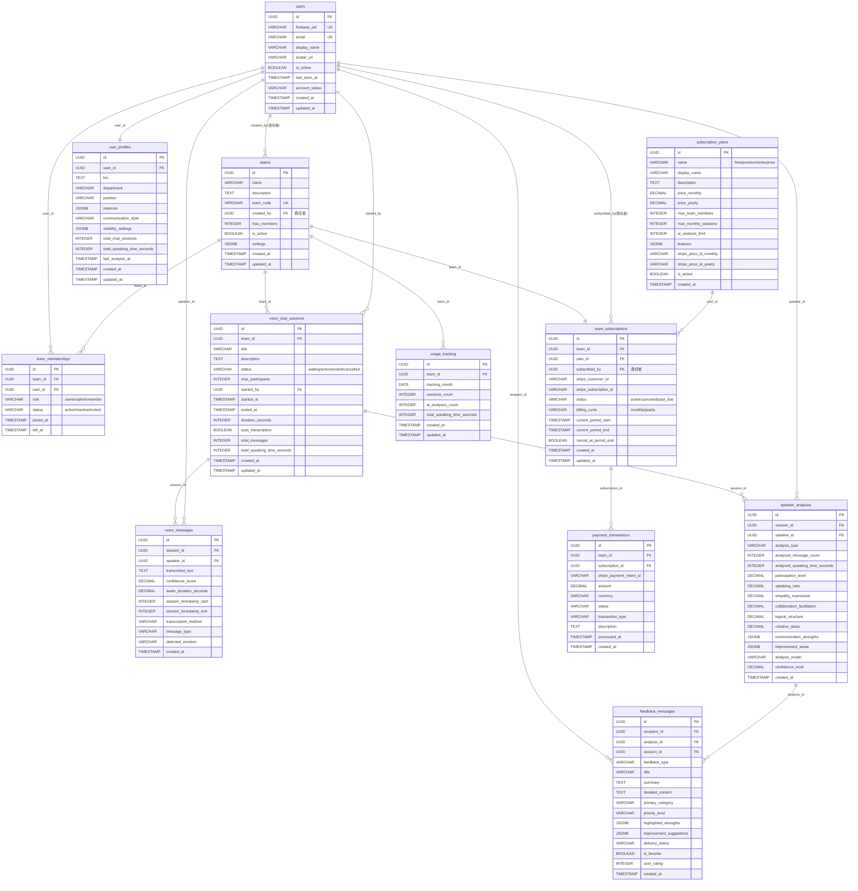

```mermaid
erDiagram
    users {
        UUID id PK
        VARCHAR firebase_uid UK
        VARCHAR email UK
        VARCHAR display_name
        VARCHAR avatar_url
        BOOLEAN is_online
        TIMESTAMP last_seen_at
        VARCHAR account_status
        TIMESTAMP created_at
        TIMESTAMP updated_at
    }

    teams {
        UUID id PK
        VARCHAR name
        TEXT description
        VARCHAR team_code UK
        UUID created_by FK "責任者"
        INTEGER max_members
        BOOLEAN is_active
        JSONB settings
        TIMESTAMP created_at
        TIMESTAMP updated_at
    }

    team_memberships {
        UUID id PK
        UUID team_id FK
        UUID user_id FK
        VARCHAR role "owner/admin/member"
        VARCHAR status "active/inactive/invited"
        TIMESTAMP joined_at
        TIMESTAMP left_at
    }

    user_profiles {
        UUID id PK
        UUID user_id FK
        TEXT bio
        VARCHAR department
        VARCHAR position
        JSONB interests
        VARCHAR communication_style
        JSONB visibility_settings
        INTEGER total_chat_sessions
        INTEGER total_speaking_time_seconds
        TIMESTAMP last_analysis_at
        TIMESTAMP created_at
        TIMESTAMP updated_at
    }

    voice_chat_sessions {
        UUID id PK
        UUID team_id FK
        VARCHAR title
        TEXT description
        VARCHAR status "waiting/active/ended/cancelled"
        INTEGER max_participants
        UUID started_by FK
        TIMESTAMP started_at
        TIMESTAMP ended_at
        INTEGER duration_seconds
        BOOLEAN auto_transcription
        INTEGER total_messages
        INTEGER total_speaking_time_seconds
        TIMESTAMP created_at
        TIMESTAMP updated_at
    }

    voice_messages {
        UUID id PK
        UUID session_id FK
        UUID speaker_id FK
        TEXT transcribed_text
        DECIMAL confidence_score
        DECIMAL audio_duration_seconds
        INTEGER session_timestamp_start
        INTEGER session_timestamp_end
        VARCHAR transcription_method
        VARCHAR message_type
        VARCHAR detected_emotion
        TIMESTAMP created_at
    }

    speaker_analyses {
        UUID id PK
        UUID session_id FK
        UUID speaker_id FK
        VARCHAR analysis_type
        INTEGER analyzed_message_count
        INTEGER analyzed_speaking_time_seconds
        DECIMAL participation_level
        DECIMAL speaking_ratio
        DECIMAL empathy_expression
        DECIMAL collaboration_facilitation
        DECIMAL logical_structure
        DECIMAL creative_ideas
        JSONB communication_strengths
        JSONB improvement_areas
        VARCHAR analysis_model
        DECIMAL confidence_level
        TIMESTAMP created_at
    }

    feedback_messages {
        UUID id PK
        UUID recipient_id FK
        UUID analysis_id FK
        UUID session_id FK
        VARCHAR feedback_type
        VARCHAR title
        TEXT summary
        TEXT detailed_content
        VARCHAR primary_category
        VARCHAR priority_level
        JSONB highlighted_strengths
        JSONB improvement_suggestions
        VARCHAR delivery_status
        BOOLEAN is_favorite
        INTEGER user_rating
        TIMESTAMP created_at
    }

    subscription_plans {
        UUID id PK
        VARCHAR name "free/premium/enterprise"
        VARCHAR display_name
        TEXT description
        DECIMAL price_monthly
        DECIMAL price_yearly
        INTEGER max_team_members
        INTEGER max_monthly_sessions
        INTEGER ai_analysis_limit
        JSONB features
        VARCHAR stripe_price_id_monthly
        VARCHAR stripe_price_id_yearly
        BOOLEAN is_active
        TIMESTAMP created_at
    }

    team_subscriptions {
        UUID id PK
        UUID team_id FK
        UUID plan_id FK
        UUID subscribed_by FK "責任者"
        VARCHAR stripe_customer_id
        VARCHAR stripe_subscription_id
        VARCHAR status "active/canceled/past_due"
        VARCHAR billing_cycle "monthly/yearly"
        TIMESTAMP current_period_start
        TIMESTAMP current_period_end
        BOOLEAN cancel_at_period_end
        TIMESTAMP created_at
        TIMESTAMP updated_at
    }

    payment_transactions {
        UUID id PK
        UUID team_id FK
        UUID subscription_id FK
        VARCHAR stripe_payment_intent_id
        DECIMAL amount
        VARCHAR currency
        VARCHAR status
        VARCHAR transaction_type
        TEXT description
        TIMESTAMP processed_at
        TIMESTAMP created_at
    }

    usage_tracking {
        UUID id PK
        UUID team_id FK
        DATE tracking_month
        INTEGER sessions_count
        INTEGER ai_analyses_count
        INTEGER total_speaking_time_seconds
        TIMESTAMP created_at
        TIMESTAMP updated_at
    }

    %% リレーションシップ
    users ||--o{ teams : "created_by(責任者)"
    users ||--o{ team_memberships : "user_id"
    teams ||--o{ team_memberships : "team_id"
    users ||--|| user_profiles : "user_id"
    teams ||--o{ voice_chat_sessions : "team_id"
    users ||--o{ voice_chat_sessions : "started_by"
    voice_chat_sessions ||--o{ voice_messages : "session_id"
    users ||--o{ voice_messages : "speaker_id"
    voice_chat_sessions ||--o{ speaker_analyses : "session_id"
    users ||--o{ speaker_analyses : "speaker_id"
    users ||--o{ feedback_messages : "recipient_id"
    speaker_analyses ||--o{ feedback_messages : "analysis_id"
    teams ||--|| team_subscriptions : "team_id"
    users ||--o{ team_subscriptions : "subscribed_by(責任者)"
    subscription_plans ||--o{ team_subscriptions : "plan_id"
    team_subscriptions ||--o{ payment_transactions : "subscription_id"
    teams ||--o{ usage_tracking : "team_id"

```