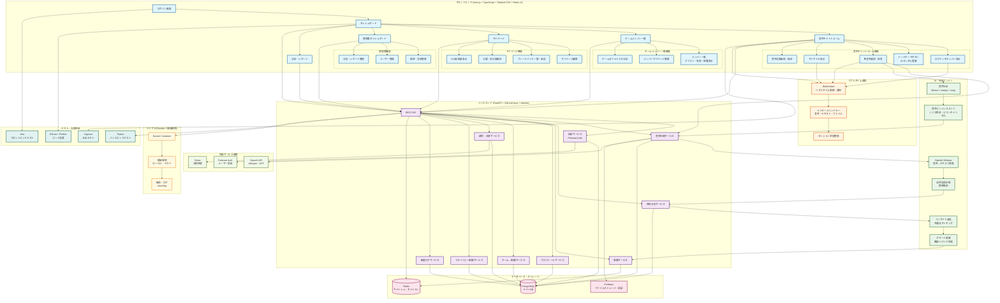

```mermaid
graph TB
%% ユーザーインターフェース層
subgraph "フロントエンド (Next.js + TypeScript + Tailwind CSS + Radix UI)"
    LOGIN[ログイン画面]
    DASH[ダッシュボード]
    CHAT[音声チャットルーム]
    TEAM[チームメンバー一覧]
    PROFILE[マイページ]
    ADMIN[管理者ダッシュボード]
    ANALYTICS[分析・レポート]

    %% 音声チャットルーム詳細
    subgraph "音声チャットルーム機能"
        MEMBERS[ログイン中メンバー表示]
        TOPICS[トークテーマボタン<br/>AIランダム提案]
        VOICE[🎙️ 音声通話・録音]
        CHAR[マイキャラ表示]
        AUDIO_QUALITY[音声品質監視・設定]
    end

    %% チームメンバー詳細
    subgraph "チームメンバー一覧機能"
        MEMBERLIST[メンバー一覧<br/>アイコン・名前・部署表示]
        MEMBERPAGE[メンバーマイページ閲覧]
        TEAM_DYNAMICS[チームダイナミクス分析]
    end

    %% マイプロフィール詳細
    subgraph "マイページ機能"
        EDIT[マイページ編集]
        FEEDBACK[フィードバック一覧・承認]
        PRIVACY[公開・非公開設定]
        AI_ANALYSIS[AI分析結果表示]
    end

    %% 管理者機能
    subgraph "管理者機能"
        BILLING[請求・決済管理]
        USER_MANAGEMENT[ユーザー管理]
        ANALYTICS_ADMIN[分析・レポート管理]
    end
end

%% API・サービス層
subgraph "バックエンド (FastAPI + SQLAlchemy + Alembic)"
    API[REST API]
    AUTH[認証サービス<br/>Firebase Auth]
    VOICE_SERVICE[音声処理サービス]
    ANALYSIS[特性分析サービス]
    RECOMMENDATION[推薦サービス]
    PROFILE_SERVICE[プロフィールサービス]
    TEAM_SERVICE[チーム・組織サービス]
    BILLING_SERVICE[請求・決済サービス]
    PRIVACY_SERVICE[プライバシー制御サービス]
    AUDIT_SERVICE[監査ログサービス]
end

%% AI・分析層
subgraph "AI・分析エンジン"
    WHISPER[OpenAI Whisper<br/>音声→テキスト変換]
    NLP[自然言語処理<br/>特性推定]
    AUDIO_ANALYSIS[音声分析<br/>librosa + numpy + scipy]
    INSIGHT[インサイト発見<br/>共通点マッチング]
    TOPIC_AI[スマート提案<br/>雑談トピック生成]
    AUDIO_ENHANCEMENT[音声エンハンスメント<br/>ノイズ除去・エコーキャンセル]
end

%% リアルタイム通信
subgraph "リアルタイム通信"
    WEBSOCKET[WebSocket<br/>リアルタイム更新・通知]
    MESSAGE_HANDLER[メッセージハンドラー<br/>音声・テキスト・ファイル]
    SESSION_MANAGER[セッション状態管理]
end

%% データ層
subgraph "データベース・ストレージ"
    POSTGRES[(PostgreSQL<br/>メインDB)]
    REDIS[(Redis<br/>キャッシュ・セッション)]
    FIREBASE[Firebase<br/>ファイルストレージ・認証]
end

%% 外部サービス連携
subgraph "外部サービス連携"
    STRIPE[Stripe<br/>決済処理]
    OPENAI[OpenAI API<br/>Whisper・GPT]
    FIREBASE_AUTH[Firebase Auth<br/>ユーザー認証]
end

%% インフラ層
subgraph "インフラ (Docker + 開発環境)"
    CONTAINER[Docker Container]
    DEV_ENV[開発環境<br/>ローカル・テスト]
    MONITOR[監視・ログ<br/>structlog]
end

%% テスト・品質保証
subgraph "テスト・品質保証"
    PYTEST[Pytest<br/>バックエンドテスト]
    JEST[Jest<br/>フロントエンドテスト]
    CYPRESS[Cypress<br/>E2Eテスト]
    LINTING[ESLint + Prettier<br/>コード品質]
end

%% フロー接続
LOGIN --> DASH
DASH --> CHAT
DASH --> TEAM
DASH --> PROFILE
DASH --> ADMIN
DASH --> ANALYTICS

CHAT --> MEMBERS
CHAT --> TOPICS
CHAT --> VOICE
CHAT --> CHAR
CHAT --> AUDIO_QUALITY

TEAM --> MEMBERLIST
TEAM --> MEMBERPAGE
TEAM --> TEAM_DYNAMICS

PROFILE --> EDIT
PROFILE --> FEEDBACK
PROFILE --> PRIVACY
PROFILE --> AI_ANALYSIS

ADMIN --> BILLING
ADMIN --> USER_MANAGEMENT
ADMIN --> ANALYTICS_ADMIN

%% サービス接続
DASH --> API
CHAT --> API
TEAM --> API
PROFILE --> API
ADMIN --> API
ANALYTICS --> API

API --> AUTH
API --> VOICE_SERVICE
API --> ANALYSIS
API --> RECOMMENDATION
API --> PROFILE_SERVICE
API --> TEAM_SERVICE
API --> BILLING_SERVICE
API --> PRIVACY_SERVICE
API --> AUDIT_SERVICE

%% AI処理フロー
VOICE --> VOICE_SERVICE
VOICE_SERVICE --> WHISPER
WHISPER --> NLP
NLP --> ANALYSIS
ANALYSIS --> INSIGHT
INSIGHT --> TOPIC_AI
TOPIC_AI --> RECOMMENDATION

%% 音声処理フロー
VOICE --> AUDIO_ANALYSIS
AUDIO_ANALYSIS --> AUDIO_ENHANCEMENT
AUDIO_ENHANCEMENT --> VOICE_SERVICE

%% データフロー
AUTH --> POSTGRES
VOICE_SERVICE --> POSTGRES
ANALYSIS --> POSTGRES
RECOMMENDATION --> REDIS
PROFILE_SERVICE --> POSTGRES
TEAM_SERVICE --> POSTGRES
BILLING_SERVICE --> POSTGRES
PRIVACY_SERVICE --> POSTGRES
AUDIT_SERVICE --> POSTGRES

API --> REDIS
VOICE_SERVICE --> FIREBASE

%% 外部サービス連携
BILLING_SERVICE --> STRIPE
VOICE_SERVICE --> OPENAI
AUTH --> FIREBASE_AUTH

%% リアルタイム通信
CHAT --> WEBSOCKET
MEMBERS --> WEBSOCKET
CHAR --> WEBSOCKET
VOICE --> WEBSOCKET

WEBSOCKET --> MESSAGE_HANDLER
MESSAGE_HANDLER --> SESSION_MANAGER

%% インフラ接続
API --> CONTAINER
CONTAINER --> DEV_ENV
DEV_ENV --> MONITOR

%% テスト接続
API --> PYTEST
LOGIN --> JEST
CHAT --> CYPRESS
DASH --> LINTING

%% スタイリング
classDef frontend fill:#e1f5fe,stroke:#01579b,stroke-width:2px
classDef backend fill:#f3e5f5,stroke:#4a148c,stroke-width:2px
classDef ai fill:#e8f5e8,stroke:#1b5e20,stroke-width:2px
classDef realtime fill:#fff3e0,stroke:#e65100,stroke-width:2px
classDef data fill:#fce4ec,stroke:#880e4f,stroke-width:2px
classDef external fill:#f1f8e9,stroke:#33691e,stroke-width:2px
classDef infra fill:#fff8e1,stroke:#f57f17,stroke-width:2px
classDef testing fill:#e0f2f1,stroke:#004d40,stroke-width:2px

class LOGIN,DASH,CHAT,TEAM,PROFILE,ADMIN,ANALYTICS,MEMBERS,TOPICS,VOICE,CHAR,AUDIO_QUALITY,MEMBERLIST,MEMBERPAGE,TEAM_DYNAMICS,EDIT,FEEDBACK,PRIVACY,AI_ANALYSIS,BILLING,USER_MANAGEMENT,ANALYTICS_ADMIN frontend
class API,AUTH,VOICE_SERVICE,ANALYSIS,RECOMMENDATION,PROFILE_SERVICE,TEAM_SERVICE,BILLING_SERVICE,PRIVACY_SERVICE,AUDIT_SERVICE backend
class WHISPER,NLP,AUDIO_ANALYSIS,INSIGHT,TOPIC_AI,AUDIO_ENHANCEMENT ai
class WEBSOCKET,MESSAGE_HANDLER,SESSION_MANAGER realtime
class POSTGRES,REDIS,FIREBASE data
class STRIPE,OPENAI,FIREBASE_AUTH external
class CONTAINER,DEV_ENV,MONITOR infra
class PYTEST,JEST,CYPRESS,LINTING testing
```