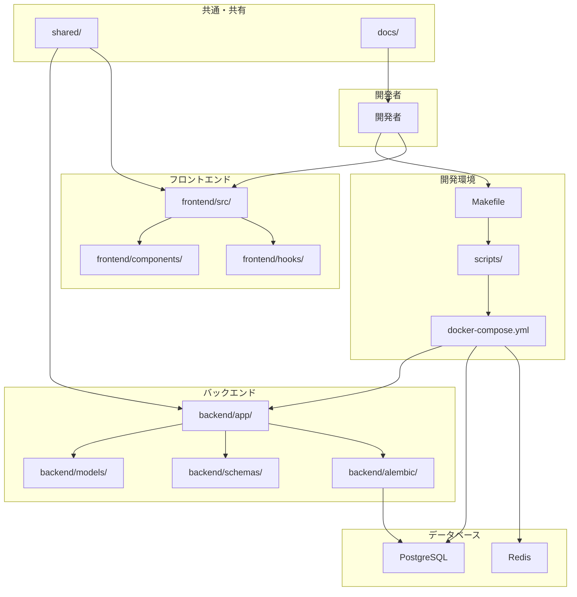
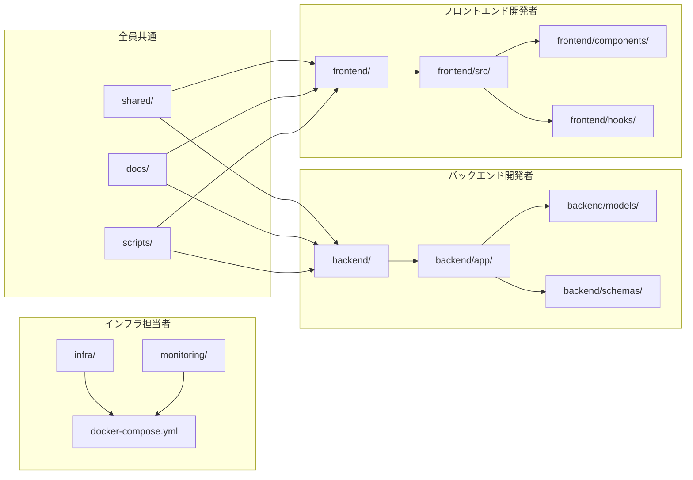
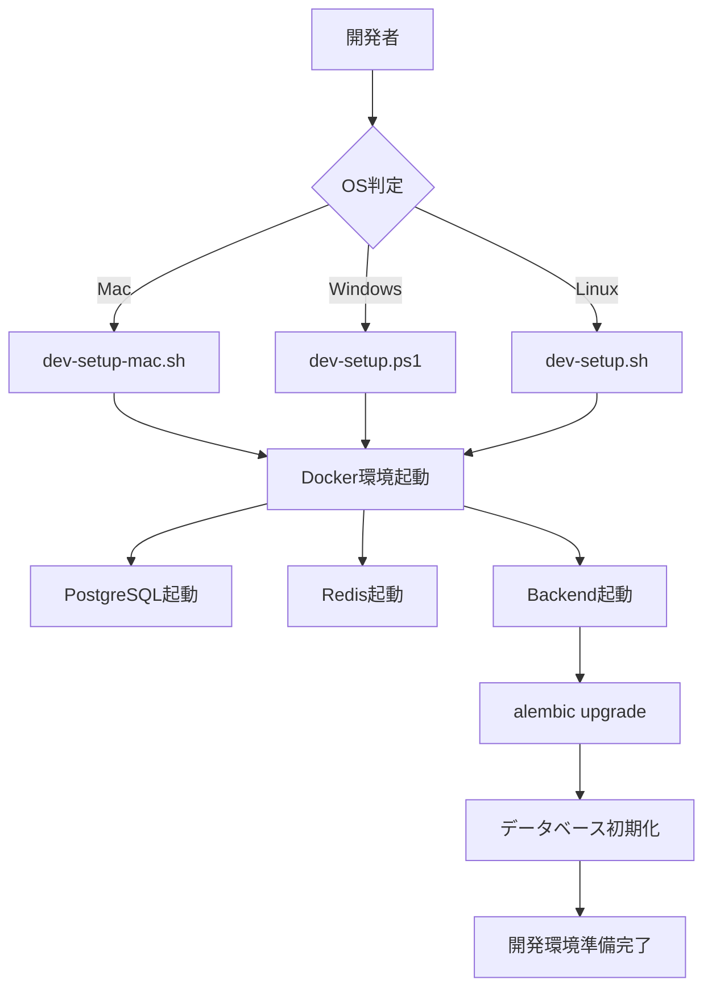
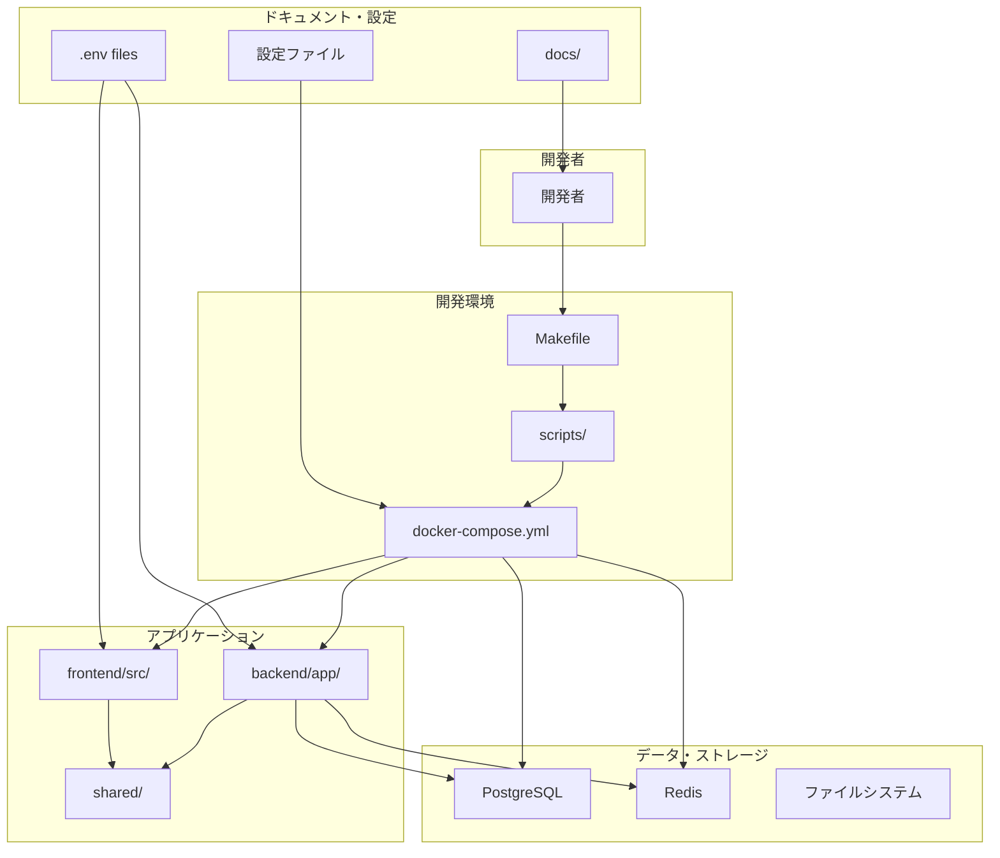

# Bridge Line プロジェクト構造図

## プロジェクト全体構造

| カテゴリ | ディレクトリ/ファイル | 説明 |
|:---------|:---------------------|:-----|
| **Docker環境** | docker-compose.yml | 全サービスのオーケストレーション |
| | backend/Dockerfile | バックエンドコンテナの定義 |
| | scripts/init_db.sql | データベース初期化スクリプト |
| **開発環境** | Makefile | 統一された開発コマンド |
| | scripts/ | OS別セットアップスクリプト |
| | .gitignore | Git除外設定 |
| **ドキュメント** | docs/ | プロジェクトドキュメント |
| | README.md | プロジェクト概要 |
| | .github/ | GitHub設定 |
| **バックエンド** | backend/ | FastAPI バックエンド |
| | backend/app/ | アプリケーション本体 |
| | backend/app/api/ | API エンドポイント |
| | backend/app/core/ | コア設定・データベース |
| | backend/app/models/ | データベースモデル |
| | backend/app/schemas/ | Pydantic スキーマ |
| | backend/app/services/ | ビジネスロジック |
| | backend/app/utils/ | ユーティリティ |
| | backend/alembic/ | データベースマイグレーション |
| | backend/tests/ | テストコード |
| | backend/requirements.txt | Python依存関係 |
| | backend/.env.example | 環境変数テンプレート |
| **フロントエンド** | frontend/ | Next.js フロントエンド |
| | frontend/src/ | ソースコード |
| | frontend/src/app/ | Next.js App Router |
| | frontend/src/components/ | React コンポーネント |
| | frontend/src/hooks/ | カスタムフック |
| | frontend/src/lib/ | ライブラリ・ユーティリティ |
| | frontend/src/store/ | 状態管理 |
| | frontend/src/types/ | TypeScript型定義 |
| | frontend/public/ | 静的ファイル |
| | frontend/package.json | Node.js依存関係 |
| **共通・共有** | shared/ | フロントエンド・バックエンド共通 |
| | shared/constants/ | 共通定数 |
| | shared/types/ | 共通型定義 |
| | shared/utils/ | 共通ユーティリティ |
| **インフラ・監視** | infra/ | 本番環境設定 |
| | infra/docker/ | Docker設定 |
| | infra/k8s/ | Kubernetes設定 |
| | infra/terraform/ | Terraform設定 |
| | infra/scripts/ | インフラスクリプト |
| | monitoring/ | 監視・ログ設定 |
| | monitoring/grafana/ | Grafanaダッシュボード |
| | monitoring/prometheus/ | Prometheus設定 |
| | monitoring/alerts/ | アラート設定 |

## データフロー関係図

## チーム開発での責任分離

## セットアップフロー

## 主要ディレクトリの役割

| ディレクトリ | 役割 | 担当者 |
|:-------------|:-----|:-------|
| **backend/** | FastAPI バックエンド | バックエンド開発者 |
| **frontend/** | Next.js フロントエンド | フロントエンド開発者 |
| **shared/** | 共通コード・型定義 | 全員 |
| **scripts/** | 開発環境セットアップ | 全員 |
| **docs/** | プロジェクトドキュメント | 全員 |
| **infra/** | 本番環境設定 | インフラ担当者 |
| **monitoring/** | 監視・ログ設定 | インフラ担当者 |

## 開発環境の全体像

> 📚 **詳細な説明と運用方法**: [プロジェクト構造説明書.md](プロジェクト構造説明書.md) 