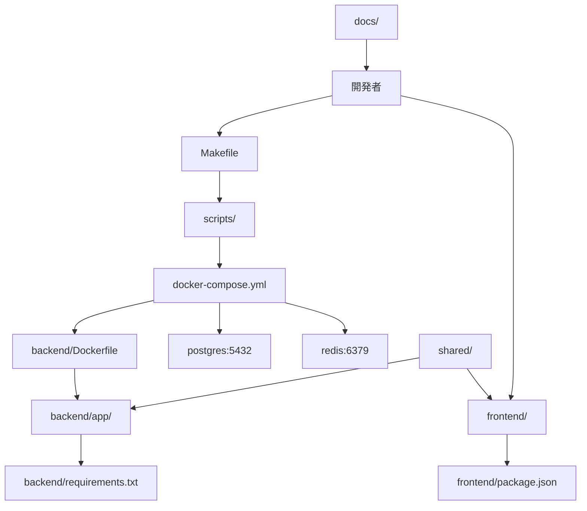
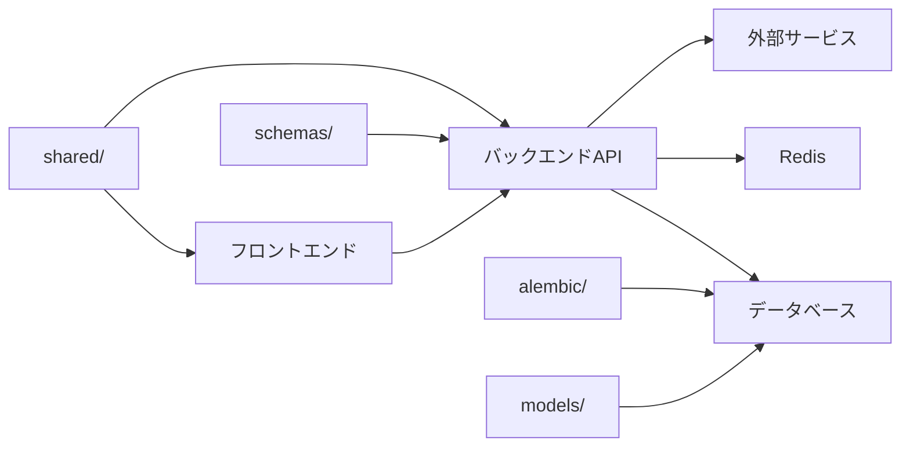
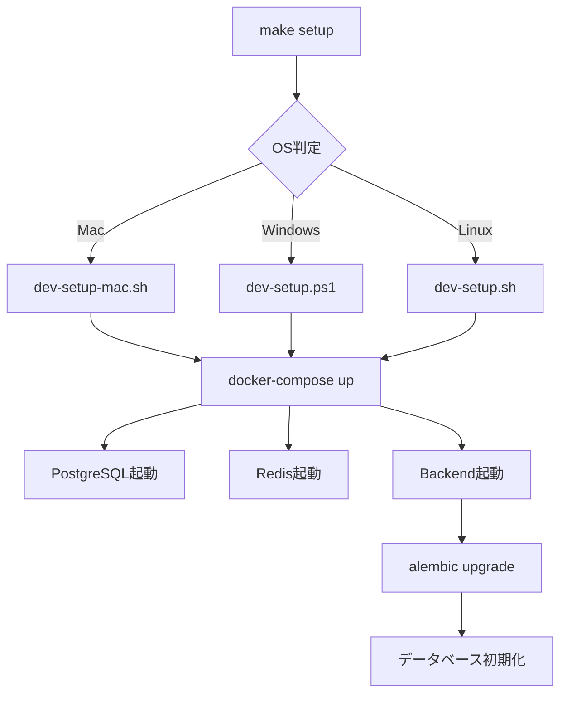

# Bridge Line プロジェクト構造説明書

## プロジェクト全体構造

```
bridge-line/
├── backend/                 # FastAPI バックエンド
│   ├── app/                 # アプリケーション本体
│   │   ├── api/            # API エンドポイント
│   │   │   ├── v1/         # API v1 エンドポイント
│   │   │   └── websocket/  # WebSocket エンドポイント
│   │   ├── core/           # コア設定・データベース
│   │   ├── models/         # データベースモデル
│   │   ├── schemas/        # Pydantic スキーマ
│   │   ├── services/       # ビジネスロジック
│   │   ├── repositories/   # データアクセス層
│   │   ├── integrations/   # 外部サービス連携
│   │   └── utils/          # ユーティリティ
│   ├── alembic/            # データベースマイグレーション
│   ├── tests/              # テストコード
│   ├── scripts/            # 開発・運用スクリプト
│   ├── Dockerfile          # バックエンド用Docker
│   ├── requirements.txt    # Python依存関係
│   └── pytest.ini         # テスト設定
│
├── frontend/               # Next.js フロントエンド
│   ├── src/               # ソースコード
│   │   ├── app/           # Next.js App Router
│   │   │   ├── admin/     # 管理者画面
│   │   │   ├── auth/      # 認証画面
│   │   │   ├── billing/   # 決済画面
│   │   │   ├── dashboard/ # ダッシュボード
│   │   │   ├── profile/   # プロフィール
│   │   │   ├── team/      # チーム管理
│   │   │   └── voice-chat/ # 音声チャット
│   │   ├── components/    # React コンポーネント
│   │   │   ├── admin/     # 管理者用コンポーネント
│   │   │   ├── analytics/ # 分析コンポーネント
│   │   │   ├── auth/      # 認証コンポーネント
│   │   │   ├── billing/   # 決済コンポーネント
│   │   │   ├── dashboard/ # ダッシュボードコンポーネント
│   │   │   ├── profile/   # プロフィールコンポーネント
│   │   │   ├── team/      # チーム管理コンポーネント
│   │   │   ├── ui/        # 共通UIコンポーネント
│   │   │   └── voice-chat/ # 音声チャットコンポーネント
│   │   ├── hooks/         # カスタムフック
│   │   ├── lib/           # ライブラリ・ユーティリティ
│   │   └── types/         # TypeScript型定義
│   ├── public/            # 静的ファイル
│   ├── cypress/           # E2Eテスト
│   ├── __tests__/         # ユニットテスト
│   ├── package.json       # Node.js依存関係
│   ├── tailwind.config.js # Tailwind CSS設定
│   └── tsconfig.json      # TypeScript設定
│
├── scripts/               # 開発・デプロイスクリプト
│   ├── dev-setup.sh      # Linux/Mac用セットアップ
│   ├── dev-setup-mac.sh  # Mac専用セットアップ
│   ├── dev-setup.ps1     # Windows用セットアップ
│   └── init_db.sql       # データベース初期化
│
├── docs/                  # プロジェクトドキュメント
│   ├── API設計書.md
│   ├── DB設計書.md
│   ├── セキュリティ仕様書.md
│   └── テスト仕様書.md
│
├── shared/                # フロントエンド・バックエンド共通
│   ├── constants/         # 共通定数
│   ├── types/            # 共通型定義
│   └── utils/            # 共通ユーティリティ
│
├── infra/                 # インフラ設定
│   ├── docker/           # Docker設定
│   ├── k8s/              # Kubernetes設定
│   ├── terraform/        # Terraform設定
│   └── scripts/          # インフラスクリプト
│
├── monitoring/            # 監視・ログ設定
│   ├── grafana/          # Grafanaダッシュボード
│   ├── prometheus/       # Prometheus設定
│   └── alerts/           # アラート設定
│
├── docker-compose.yml    # Docker環境設定
├── Makefile              # 開発用コマンド
├── README.md             # プロジェクト概要
└── .gitignore            # Git除外設定
```

## ディレクトリ間の相互関係

### 1. 開発環境の関係図



### 2. データフロー関係図



### 3. セットアップスクリプトの関係



## 各ディレクトリの役割と責任

### Docker環境関連
- **docker-compose.yml**: 全サービスのオーケストレーション
- **backend/Dockerfile**: バックエンドコンテナの定義
- **scripts/init_db.sql**: データベース初期化スクリプト

### 開発環境関連
- **Makefile**: 統一された開発コマンド
- **scripts/dev-setup-*.sh/ps1**: OS別セットアップスクリプト
- **.gitignore**: バージョン管理除外設定

### バックエンド関連
- **backend/app/**: FastAPIアプリケーション本体
  - api/: REST APIエンドポイント
  - core/: データベース接続・認証
  - models/: SQLAlchemyモデル
  - schemas/: リクエスト/レスポンス定義
  - services/: ビジネスロジック
- **backend/alembic/**: データベースマイグレーション
- **backend/tests/**: テストコード

### フロントエンド関連
- **frontend/src/app/**: Next.js App Router
- **frontend/src/components/**: Reactコンポーネント
- **frontend/src/hooks/**: カスタムフック
- **frontend/src/lib/**: 外部ライブラリ設定
- **frontend/src/store/**: 状態管理
- **frontend/src/types/**: TypeScript型定義

### 共通・共有関連
- **shared/**: フロントエンド・バックエンド共通
  - constants/: APIエンドポイント、エラーコード
  - types/: 共通型定義
  - utils/: 共通ユーティリティ

### ドキュメント関連
- **docs/**: プロジェクトドキュメント
  - API設計書、DB設計書、セキュリティ仕様書

### インフラ関連
- **infra/**: 本番環境設定
  - docker/: 本番用Docker設定
  - k8s/: Kubernetes設定
  - terraform/: インフラコード

### 監視関連
- **monitoring/**: 監視・ログ設定
  - Grafana、Prometheus、アラート設定

## 開発フローの関係

### 1. 新機能開発フロー
```
1. 開発者 → Makefile → セットアップスクリプト
2. セットアップスクリプト → Docker環境起動
3. 開発者 → backend/models/ → データベースモデル定義
4. 開発者 → backend/alembic/ → マイグレーション作成
5. 開発者 → backend/schemas/ → APIスキーマ定義
6. 開発者 → backend/api/ → APIエンドポイント実装
7. 開発者 → frontend/src/ → フロントエンド実装
8. 開発者 → shared/ → 共通型・定数定義
```

### 2. デプロイフロー
```
1. 開発者 → infra/ → インフラ設定
2. 開発者 → monitoring/ → 監視設定
3. CI/CD → docker-compose.yml → 本番環境
4. 本番環境 → PostgreSQL → データベース
5. 本番環境 → Redis → キャッシュ・セッション
```

## チーム開発での注意点

### 1. ディレクトリの責任分離
- **バックエンド開発者**: backend/ 配下のみ変更
- **フロントエンド開発者**: frontend/ 配下のみ変更
- **インフラ担当者**: infra/, monitoring/ 配下を管理
- **全員共通**: shared/, docs/ の更新

### 2. 環境変数の管理
- **開発環境**: backend/.env.example → backend/.env
- **本番環境**: infra/ 配下で管理

### 3. データベース変更
- モデル変更 → backend/models/
- マイグレーション → backend/alembic/
- 初期データ → scripts/init_db.sql

### 4. API変更
- スキーマ定義 → backend/schemas/
- エンドポイント → backend/api/
- 共通型 → shared/types/

## 明日の横展開で伝えるべきポイント

### 1. セットアップ手順
```bash
# 全OS共通
make setup

# またはOS別
./scripts/dev-setup-mac.sh    # Mac
./scripts/dev-setup.ps1       # Windows
./scripts/dev-setup.sh        # Linux
```

### 2. 開発コマンド
```bash
make start      # 環境起動
make stop       # 環境停止
make logs       # ログ確認
make migrate    # マイグレーション
make test       # テスト実行
```

### 3. ディレクトリ構造の理解
- **backend/**: Python/FastAPI開発
- **frontend/**: Next.js/React開発
- **shared/**: 共通コード
- **scripts/**: 開発環境セットアップ
- **docs/**: プロジェクトドキュメント

### 4. チーム開発のルール
- 各ディレクトリの責任を明確に分離
- 共通コードは shared/ に配置
- ドキュメントは docs/ に集約
- 環境設定は scripts/ で統一

この構造により、チームメンバー全員が統一された環境で効率的に開発を進めることができます。 