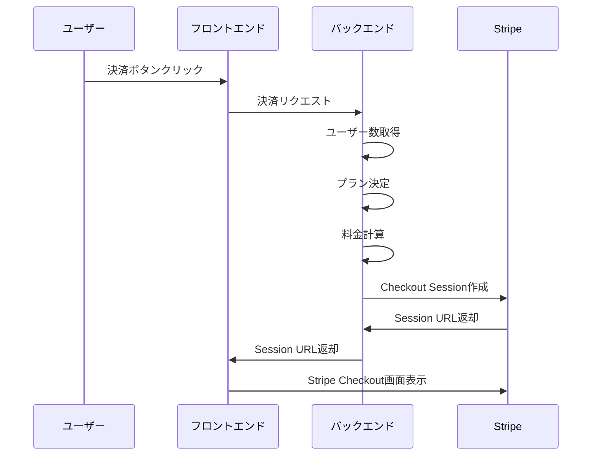
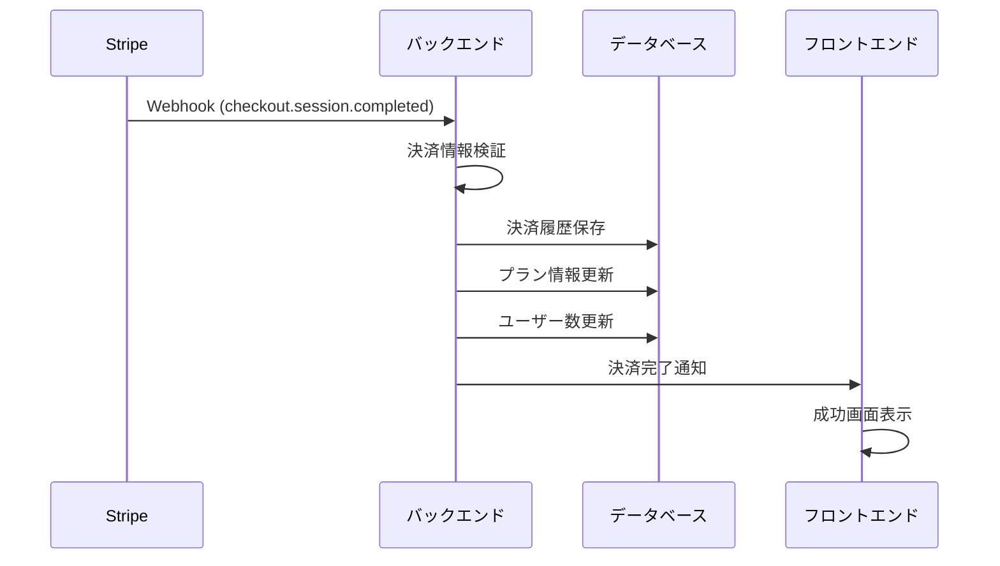

# 決済システム仕様書

## 概要

Bridge LINEの決済システムは、Stripeを利用したサブスクリプション型の決済システムです。ユーザー数に基づいて動的にプランが決定され、月額・年額の料金体系を提供します。

## システム構成

### アーキテクチャ
```
フロントエンド (Next.js)
    ↓
バックエンド API (FastAPI)
    ↓
Stripe API
    ↓
Webhook処理
    ↓
データベース (PostgreSQL)
```

### 主要コンポーネント
- **フロントエンド**: 決済管理画面、プラン表示
- **バックエンド**: 決済処理、プラン管理、Webhook処理
- **Stripe**: 決済処理、サブスクリプション管理
- **データベース**: 決済履歴、プラン情報、ユーザー情報

## プラン仕様

### プラン構成
| プラン | 月額料金 | 年額料金 | 最大ユーザー数 | 最大セッション数 | 割引率 |
|--------|----------|----------|----------------|------------------|--------|
| Basic | 980円 | 9,800円 | 10名 | 50セッション/月 | 20% |
| Premium | 2,980円 | 29,800円 | 50名 | 200セッション/月 | 20% |
| Enterprise | 9,800円 | 98,000円 | 無制限 | 無制限 | 20% |

### 年額プラン詳細
- **Basic Plan**: 年額9,800円（月額換算：784円）
- **Premium Plan**: 年額29,800円（月額換算：2,384円）
- **Enterprise Plan**: 年額98,000円（月額換算：7,840円）

### 動的プラン決定ロジック
```python
def get_plan_by_user_count(user_count: int) -> str:
    if user_count <= 10:
        return "basic"
    elif user_count <= 50:
        return "premium"
    else:
        return "enterprise"
```

## 決済フロー

### 1. 決済開始フロー


### 2. 決済完了フロー


## API仕様

### エンドポイント一覧

#### 1. ユーザー数取得
```http
GET /api/v1/admin/billing/user-count
```

**レスポンス**
```json
{
  "total_users": 15,
  "organization_id": "550e8400-e29b-41d4-a716-446655440000"
}
```

#### 2. 決済セッション作成
```http
POST /api/v1/admin/billing/checkout
```

**リクエスト**
```json
{
  "organization_id": "550e8400-e29b-41d4-a716-446655440000",
  "additional_users": 5
}
```

**レスポンス**
```json
{
  "session_id": "cs_test_1234567890",
  "checkout_url": "https://checkout.stripe.com/pay/cs_test_1234567890",
  "expires_at": "2024-01-15T10:30:00Z"
}
```

#### 3. Stripe Webhook
```http
POST /api/v1/webhooks/stripe
```

**処理対象イベント**
- `checkout.session.completed`
- `invoice.payment_succeeded`
- `invoice.payment_failed`
- `customer.subscription.updated`
- `customer.subscription.deleted`

## データベース設計

### 主要テーブル

#### subscriptions
```sql
CREATE TABLE subscriptions (
    id SERIAL PRIMARY KEY,
    user_id INTEGER REFERENCES users(id),
    organization_id INTEGER REFERENCES organizations(id),
    stripe_subscription_id VARCHAR(255) UNIQUE NOT NULL,
    stripe_price_id VARCHAR(255),
    status VARCHAR(50) NOT NULL,
    current_period_start TIMESTAMP WITH TIME ZONE,
    current_period_end TIMESTAMP WITH TIME ZONE,
    canceled_at TIMESTAMP WITH TIME ZONE,
    ended_at TIMESTAMP WITH TIME ZONE,
    quantity INTEGER NOT NULL DEFAULT 0,
    subscription_metadata JSON,
    created_at TIMESTAMP WITH TIME ZONE DEFAULT NOW(),
    updated_at TIMESTAMP WITH TIME ZONE DEFAULT NOW()
);
```

#### billing
```sql
CREATE TABLE billing (
    id SERIAL PRIMARY KEY,
    subscription_id INTEGER REFERENCES subscriptions(id),
    stripe_payment_intent_id VARCHAR(255),
    amount INTEGER NOT NULL,
    currency VARCHAR(3) DEFAULT 'JPY',
    status VARCHAR(50),
    transaction_type VARCHAR(50),
    description TEXT,
    processed_at TIMESTAMP WITH TIME ZONE,
    created_at TIMESTAMP WITH TIME ZONE DEFAULT NOW()
);
```

## フロントエンド仕様

### 主要コンポーネント

#### 1. AdminBillingOverview
- **機能**: 決済概要表示
- **表示内容**: 現在のプラン、料金、次回請求日
- **更新頻度**: リアルタイム

#### 2. AdminBillingActions
- **機能**: 決済アクション
- **表示内容**: 決済ボタン、プラン情報
- **動作**: Stripe Checkout画面への遷移

#### 3. PricingCard
- **機能**: プラン詳細表示
- **表示内容**: プラン名、料金、機能一覧
- **更新**: 動的プラン情報

#### 4. AdminStripeCheckout
- **機能**: Stripe決済フォーム
- **表示内容**: 決済情報入力フォーム
- **処理**: 決済セッション作成

### 状態管理
```typescript
interface BillingState {
  currentPlan: string;
  userCount: number;
  monthlyPrice: number;
  yearlyPrice: number;
  nextBillingDate: Date;
  isProcessing: boolean;
}
```

## セキュリティ仕様

### 認証・認可
- **管理者権限**: 決済操作は管理者のみ
- **JWT認証**: APIアクセス時の認証
- **セッション管理**: 安全なセッション管理

### データ保護
- **暗号化**: 決済情報の暗号化
- **PCI DSS**: Stripeによる準拠
- **個人情報保護**: 最小限の情報収集

### Webhook検証
```python
def verify_stripe_webhook(payload: bytes, signature: str) -> bool:
    """Stripe Webhookの署名検証"""
    try:
        event = stripe.Webhook.construct_event(
            payload, signature, settings.STRIPE_WEBHOOK_SECRET
        )
        return True
    except ValueError:
        return False
    except stripe.error.SignatureVerificationError:
        return False
```

## エラーハンドリング

### エラー種別
1. **決済エラー**: Stripe API エラー
2. **バリデーションエラー**: 入力データ不正
3. **システムエラー**: データベース接続エラー
4. **権限エラー**: 認証・認可エラー

### エラー処理フロー
```python
try:
    # 決済処理
    result = process_payment(payment_data)
except stripe.error.StripeError as e:
    logger.error(f"Stripe error: {str(e)}")
    raise HTTPException(status_code=400, detail="決済処理に失敗しました")
except Exception as e:
    logger.error(f"System error: {str(e)}")
    raise HTTPException(status_code=500, detail="システムエラーが発生しました")
```

## 監視・ログ

### ログ出力
- **決済開始**: ユーザー情報、プラン情報
- **決済完了**: 決済ID、金額、ステータス
- **エラー**: エラー種別、詳細情報
- **Webhook**: イベント種別、処理結果

### 監視項目
- **決済成功率**: 決済完了率の監視
- **応答時間**: API応答時間の監視
- **エラー率**: エラー発生率の監視
- **Webhook処理**: Webhook処理時間の監視

## テスト仕様

### テスト種別
1. **単体テスト**: 個別機能のテスト
2. **統合テスト**: API連携のテスト
3. **E2Eテスト**: 決済フロー全体のテスト
4. **パフォーマンステスト**: 負荷テスト

### テストデータ
- **プラン情報**: 各プランの詳細情報
- **ユーザーデータ**: テスト用ユーザー情報
- **決済データ**: テスト用決済情報
- **Webhookイベント**: テスト用Stripeイベント

## 運用仕様

### デプロイメント
- **環境**: 本番環境、ステージング環境
- **CI/CD**: GitHub Actions
- **監視**: ログ監視、アラート設定

### バックアップ
- **データベース**: 日次バックアップ
- **ログ**: 30日間保持
- **決済履歴**: 永続保持

### メンテナンス
- **定期メンテナンス**: 月次
- **緊急メンテナンス**: 必要時
- **通知**: メンテナンス前の事前通知

## 今後の拡張予定

### 機能拡張
- **複数通貨対応**: USD、EUR対応
- **カスタムプラン**: 企業向けカスタムプラン
- **使用量ベース課金**: セッション数ベースの課金
- **自動課金**: 使用量に応じた自動課金

### 技術改善
- **キャッシュ機能**: 決済情報のキャッシュ
- **バッチ処理**: 大量決済のバッチ処理
- **API最適化**: レスポンス時間の改善
- **セキュリティ強化**: 追加セキュリティ機能

---

> 📚 **関連ドキュメント**: [API設計書.md](API設計書.md) | [テスト仕様書.md](テスト仕様書.md) | [総合仕様書.md](総合仕様書.md)
