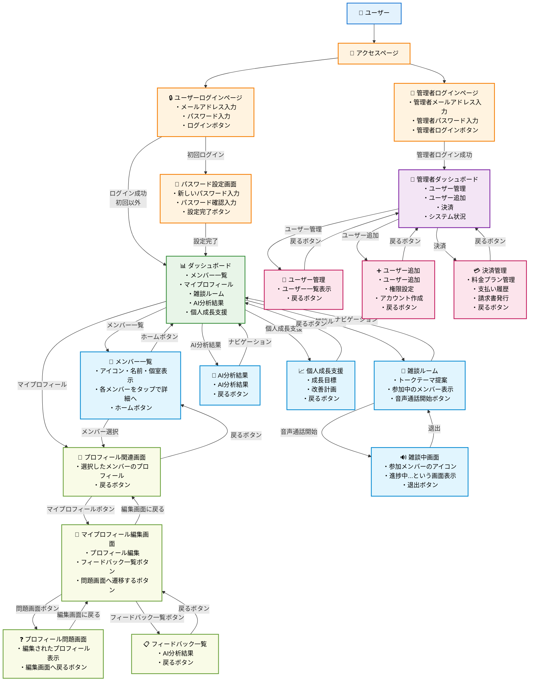

```mermaid
flowchart TD
    A["👤 ユーザー"] --> B["📱 アクセスページ"]
    B --> C["🔒 ユーザーログインページ<br>・メールアドレス入力<br>・パスワード入力<br>・ログインボタン"] & D["🔑 管理者ログインページ<br>・管理者メールアドレス入力<br>・管理者パスワード入力<br>・管理者ログインボタン"]
    C -- ログイン成功<br>初回以外 --> E["📊 ダッシュボード<br>・メンバー一覧<br>・マイプロフィール<br>・雑談ルーム<br>・AI分析結果<br>・個人成長支援"]
    C -- 初回ログイン --> S["🔑 パスワード設定画面<br>・新しいパスワード入力<br>・パスワード確認入力<br>・設定完了ボタン"]
    S -- 設定完了 --> E
    D -- 管理者ログイン成功 --> F["🔧 管理者ダッシュボード<br>・ユーザー管理<br>・ユーザー追加<br>・決済<br>・システム状況"]
    F -- ユーザー管理 --> G["👥 ユーザー管理<br>・ユーザー一覧表示<br>・戻るボタン"]
    F -- ユーザー追加 --> H["➕ ユーザー追加<br>・ユーザー追加<br>・権限設定<br>・アカウント作成<br>・戻るボタン"]
    F -- 決済 --> I["💳 決済管理<br>・料金プラン管理<br>・支払い履歴<br>・請求書発行<br>・戻るボタン"]
    G -- 戻るボタン --> F
    H -- 戻るボタン --> F
    I -- 戻るボタン --> F
    E -- メンバー一覧 --> J["👥 メンバー一覧<br>・アイコン・名前・個室表示<br>・各メンバーをタップで詳細へ<br>・ホームボタン"]
    E -- マイプロフィール --> K["👤 プロフィール関連画面<br>・選択したメンバーのプロ<br>フィール<br>・戻るボタン"]
    E -- 雑談ルーム --> L["💬 雑談ルーム<br>・トークテーマ提案<br>・参加中のメンバー表示<br>・音声通話開始ボタン"]
    E -- AI分析結果 --> M["🧠 AI分析結果<br>・AI分析結果<br>・戻るボタン"]
    E -- 個人成長支援 --> N["📈 個人成長支援<br>・成長目標<br>・改善計画<br>・戻るボタン"]
    J -- ホームボタン --> E
    J -- メンバー選択 --> K
    K -- 戻るボタン --> J
    K -- マイプロフィールボタン --> O["📝 マイプロフィール編集画面<br>・プロフィール編集<br>・フィードバック一覧ボタン<br>・問題画面へ遷移するボタン"]
    L -- ナビゲーション --> E
    L -- 音声通話開始 --> R["🔊 雑談中画面<br>・参加メンバーのアイコン<br>・進捗中...という画面表示<br>・退出ボタン"]
    M -- ナビゲーション --> E
    N -- 戻るボタン --> E
    R -- 退出 --> L
    O -- 問題画面ボタン --> P["❓ プロフィール問題画面<br>・編集されたプロフィール表示<br>・編集画面へ戻るボタン"]
    O -- フィードバック一覧ボタン --> Q["📋 フィードバック一覧<br>・AI分析結果<br>・戻るボタン"]
    O -- 編集画面に戻る --> K
    P -- 編集画面に戻る --> O
    Q -- 戻るボタン --> O

     A:::userStart
     B:::loginPages
     C:::loginPages
     D:::loginPages
     E:::userDashboard
     S:::loginPages
     F:::adminDashboard
     G:::adminFeatures
     H:::adminFeatures
     I:::adminFeatures
     J:::userFeatures
     K:::profilePages
     L:::userFeatures
     M:::userFeatures
     N:::userFeatures
     O:::profilePages
     R:::userFeatures
     P:::profilePages
     Q:::profilePages
    classDef userStart fill:#E3F2FD,stroke:#1976D2,stroke-width:2px,color:#000
    classDef loginPages fill:#FFF3E0,stroke:#F57C00,stroke-width:2px,color:#000
    classDef userDashboard fill:#E8F5E8,stroke:#388E3C,stroke-width:2px,color:#000
    classDef adminDashboard fill:#F3E5F5,stroke:#7B1FA2,stroke-width:2px,color:#000
    classDef userFeatures fill:#E1F5FE,stroke:#0288D1,stroke-width:2px,color:#000
    classDef adminFeatures fill:#FCE4EC,stroke:#C2185B,stroke-width:2px,color:#000
    classDef profilePages fill:#F9FBE7,stroke:#689F38,stroke-width:2px,color:#000
```